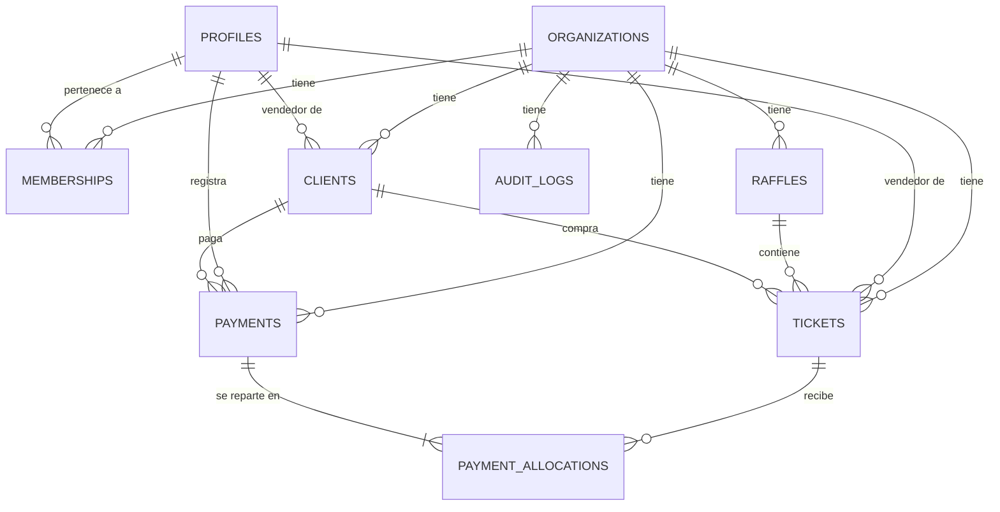

# MODELO DE DATOS

- **Versión:** 2.13 · **Estado:** implementado · **Actualizado:** 2026-09-02
- **Estado:** el esquema ejecutable vive en las migraciones `0001`–`0044`, **las 44 aplicadas y
  verificadas en local y en el proyecto Supabase real** (D-149, D-151, D-156, D-158, D-159).
  `0043` (catálogo público) y `0044` (revocar la función interna a `service_role`) se promovieron el
  2026-09-02 tras el respaldo `Rifas-backups/2026-09-02-pre-0043/`.
- *Corrección documental (2026-09-01, D-158):* esta línea decía que `0041` seguía solo en local. Se
  escribió en D-152, cuando era cierto, y no se actualizó al promoverla en **D-156**; `PHASE_STATUS`
  §3215 y `HANDOFF` §1 ya la daban por aplicada. Se corrige aquí.
- Este documento describe el diseño; la **fuente de verdad ejecutable** son las migraciones y los
  tipos generados en `src/types/database.types.ts`. Las pruebas de `tests/db/` verifican el
  esquema local; producción se comprueba con `verify:remote` y las sondas registradas en
  `TEST_RESULTS.md`.

### Ajustes introducidos al implementar (Fase 2)

| Cambio | Motivo | Decisión |
|---|---|---|
| `short_code` e `internal_code` con `DEFAULT ''` + `CHECK <> ''` | Los genera un trigger; sin DEFAULT los tipos los exigían al insertar | D-039 |
| Agregaciones monetarias de las vistas casteadas a `bigint` | `sum(bigint)` devuelve `numeric` y rompía la consistencia de tipos | D-040 |
| Trigger `tickets_guard_paid_amount` | Impide escribir un `paid_amount` inventado, aunque se tenga permiso sobre la fila | — |
| Migraciones `0009`/`0010` de privilegios | Los `GRANT` por defecto de Supabase no son iguales en todos los entornos | D-037, D-038 |
| Auditoría con lista de exclusión | Evita miles de entradas por contadores internos y columnas derivadas | D-041 |

### Ajustes introducidos al implementar (Fase 3)

| Cambio | Motivo | Decisión |
|---|---|---|
| `0011`: `profiles_select` deja de exigir que la membresía **objetivo** esté activa | Al desactivar a un usuario desaparecía del listado y no se podía reactivar | I-011 |

### Ajustes introducidos al implementar (Fase 5)

| Cambio | Motivo | Decisión |
|---|---|---|
| `0012`: `v_payment_history` pasa a **LEFT JOIN** sobre `profiles` y añade `voided_by_name` | Con INNER JOIN, un nombre invisible para quien consulta borraba el pago entero de su historial | I-015 |

**Regla que se desprende:** en una vista `security_invoker`, todo `JOIN` contra una tabla con RLS
debe ser `LEFT JOIN` salvo que se pueda demostrar que quien ve la fila principal ve también la
unida. Un INNER JOIN ahí no filtra columnas: elimina filas.

### Ajustes introducidos al implementar (Fase 6)

| Cambio | Motivo | Decisión |
|---|---|---|
| `0013`: funciones `report_payment_totals` y `report_payments_by_day` | El reporte de pagos necesita agregados **parametrizados** por rango, vendedor, método y estado. Una vista no acepta parámetros, y agrupar por todas esas columnas para poder filtrarlas después supera el límite de 1.000 filas de PostgREST | D-057 |

**Regla que se desprende:** un agregado con parámetros es una **función `stable security invoker`**,
no una vista. `SECURITY INVOKER` —al contrario que las RPC de escritura de `0007`, que son
`SECURITY DEFINER`— porque solo lee: así hereda la RLS de quien consulta y el aislamiento entre
vendedores se mantiene sin que la función filtre nada.

---

## 1. Diagrama entidad-relación



`auth.users` (gestionada por Supabase Auth) se relaciona 1:1 con `profiles` mediante el mismo `id`.

---

## 2. Estrategia multiorganización

| Decisión | Detalle |
|----------|---------|
| Frontera | `organizations.id`. Ningún dato cruza esa frontera. |
| Propagación | **Todas** las tablas de negocio llevan `organization_id` propio y `NOT NULL`. |
| Consistencia | Claves foráneas **compuestas** que incluyen `organization_id` (ver §4.3). Es imposible que una boleta apunte a una rifa de otra organización. |
| Pertenencia de usuario | Tabla `memberships` (usuario × organización × rol). Un usuario puede, en el futuro, pertenecer a varias organizaciones. |
| Organización activa | En el MVP se deriva de la única membresía activa del usuario. Antes de permitir varias, se elegirá explícitamente con contexto firmado y sesión, consultas y RLS deberán compartir ese alcance (I-047). |

---

## 3. Convenciones

### 3.1 Generales
- Claves primarias `uuid` con `DEFAULT gen_random_uuid()`.
- `created_at timestamptz NOT NULL DEFAULT now()`; `updated_at timestamptz NOT NULL DEFAULT now()`
  mantenida por el trigger genérico `set_updated_at()`.
- Nombres de tabla en plural, en inglés, `snake_case`. Valores de enumeración en inglés; las
  etiquetas en español viven en la aplicación (`lib/constants.ts`).
- Borrado físico prohibido en entidades con historial: se usa `archived_at`, `cancelled_at` o
  `voided_at`.

### 3.2 Tipos por naturaleza del dato

| Naturaleza | Tipo | Razón |
|------------|------|-------|
| Dinero | `bigint` (pesos enteros) | Sin errores de punto flotante; `bigint` evita desbordes en acumulados |
| Números de boleta | `text` | Conserva ceros iniciales; nunca se castea a numérico |
| Fecha de negocio (`sale_date`, `payment_date`) | `date` | Es un día calendario en `America/Bogota`, no un instante |
| Marca de tiempo técnica | `timestamptz` | Instante absoluto, almacenado en UTC |
| Estado | `enum` de PostgreSQL | Valores cerrados, validados por el motor |
| Datos flexibles de auditoría | `jsonb` | Estructura variable por entidad |

> **Prohibido:** `float`, `real`, `double precision`, `money` y `numeric` para valores monetarios.

### 3.3 Tipos enumerados

```sql
CREATE TYPE app_role            AS ENUM ('owner', 'admin', 'seller');
CREATE TYPE raffle_status       AS ENUM ('draft', 'active', 'closed', 'cancelled');
CREATE TYPE ticket_inventory_status AS ENUM ('draft', 'pending_approval', 'available', 'assigned', 'cancelled');
CREATE TYPE ticket_payment_status   AS ENUM ('unpaid', 'partial', 'paid');
CREATE TYPE payment_method      AS ENUM ('cash', 'transfer', 'other');
CREATE TYPE lottery_code        AS ENUM (
  'cundinamarca', 'cruz_roja', 'meta', 'bogota', 'medellin', 'boyaca'
);
CREATE TYPE lottery_schedule_status AS ENUM (
  'scheduled', 'rescheduled_later', 'rescheduled_earlier', 'suspended',
  'cancelled', 'completed', 'schedule_unverified', 'schedule_conflict'
);
CREATE TYPE lottery_schedule_change_reason AS ENUM (
  'holiday', 'official_change', 'force_majeure', 'unknown'
);
CREATE TYPE lottery_result_validation_status AS ENUM (
  'pending', 'confirmed', 'rejected', 'conflict'
);
CREATE TYPE lottery_match_field AS ENUM ('daily_number', 'weekly_number');
CREATE TYPE lottery_assignment_status AS ENUM (
  'sold', 'available', 'late_assignment'
);
```

Los tipos de lotería nacen en `0036` (D-140..D-142). El número mayor es `text` de cuatro dígitos,
nunca un entero.

---


### lottery_source_observations (0045, D-162)

Lo que dijo **cada fuente** sobre un sorteo. Existe porque un agregador no es una autoridad: un
número solo se confirma si **dos dominios distintos** dicen lo mismo (BR-L26).

| Columna | Nota |
|---|---|
| `schedule_id` | FK a `lottery_draw_schedules`, `on delete cascade` |
| `source_id` | El **dominio**: `official`, `pagatodo`, `perlatodo`, `ganarchance`, `loteriasdehoy`. Dos rutas del mismo sitio comparten `source_id` |
| `source_class` | `official` o `alternative`; un `check` obliga a que `official` sea la una y solo la una |
| `observed_date`, `winning_number`, `series`, `observed_draw_number` | Lo extraído. El número mayor son cuatro dígitos exactos; el sorteo, solo si la fuente lo publica —**nunca se rellena** con el de la programación— |
| `content_hash`, `fetched_at`, `evidence` | Trazabilidad mínima. **No se guarda HTML, PDF ni texto sin procesar** (BR-L16) |
| `UNIQUE (schedule_id, source_id)` | Lo que hace honesto el consenso: dos ticks de la misma fuente **actualizan** una observación, no suman dos votos |

**RLS:** activada y forzada, **sin política de `SELECT` para `authenticated`**. Es bitácora
operativa, como `lottery_sync_runs`: un vendedor no tiene por qué ver números sin confirmar, y el
Panel no lee esta tabla.

**`lottery_sync_runs.strategy`** (`0045`): `official` o `alternative`. Los reintentos se cuentan
por sorteo **y** por estrategia, de modo que un sorteo que agotó sus seis intentos contra una fuente
oficial rota empieza de cero en la vía alternativa **sin borrar ni reescribir la bitácora**.

**`lottery_results.source_kind`** admite además `alternative_consensus`, que es lo que permite al
Panel decir «Verificado por 2 fuentes» en vez de hacerlo pasar por oficial.

## 4. Tablas

### 4.1 `organizations`

| Columna | Tipo | Restricciones |
|---------|------|---------------|
| `id` | `uuid` | PK, `DEFAULT gen_random_uuid()` |
| `name` | `text` | `NOT NULL`, `CHECK (length(btrim(name)) BETWEEN 2 AND 120)` |
| `default_ticket_price` | `bigint` | `NOT NULL DEFAULT 120000` (`0027`), `CHECK (> 0)` |
| `currency` | `char(3)` | `NOT NULL DEFAULT 'COP'`, `CHECK (currency = 'COP')` (MVP) |
| `timezone` | `text` | `NOT NULL DEFAULT 'America/Bogota'` |
| `raffle_counter` | `int` | `NOT NULL DEFAULT 0` — genera `raffles.short_code` |
| `is_active` | `boolean` | `NOT NULL DEFAULT true` |
| `created_at` / `updated_at` | `timestamptz` | `NOT NULL DEFAULT now()` |

### 4.2 `profiles` (1:1 con `auth.users`)

| Columna | Tipo | Restricciones |
|---------|------|---------------|
| `id` | `uuid` | PK, FK → `auth.users(id)` `ON DELETE CASCADE` |
| `full_name` | `text` | `NOT NULL`, `CHECK (length(btrim(full_name)) >= 2)` |
| `alias` | `text` | `NULL` |
| `phone` | `text` | `NOT NULL`, `CHECK (phone ~ '^[0-9+ ()-]{7,20}$')` |
| `email` | `text` | `NOT NULL` — copia desnormalizada de `auth.users.email` para búsqueda |
| `is_active` | `boolean` | `NOT NULL DEFAULT true` — desactivación global de la persona |
| `activated_at` | `timestamptz` | `NULL` = **invitación pendiente**: nunca configuró su contraseña (`0026`, BR-E14) |
| `created_at` / `updated_at` | `timestamptz` | `NOT NULL DEFAULT now()` |

- Se crea automáticamente con un trigger `AFTER INSERT ON auth.users`. Si la cuenta nace **con**
  contraseña (`auth.admin.createUser`, seed y pruebas), nace también con `activated_at`.
- `email` se sincroniza con un trigger sobre `auth.users`; la fuente de verdad sigue siendo Auth.
- `activated_at` **no** se deduce de `auth.users`: lo escribe `mark_profile_activated()` cuando la
  persona termina de definir su contraseña o entra con una. GoTrue escribe un hash aleatorio en
  `encrypted_password` con solo abrir el enlace de la invitación, así que esa columna no distingue
  «abrió el correo» de «configuró su cuenta» (D-097, prueba BD E2-02). Índice parcial
  `profiles_pending_activation_idx` para la única pregunta que se le hace: quién sigue pendiente.
- `is_active` y `activated_at` responden cosas distintas y no se mezclan: la primera, «¿le quitaron
  el acceso?»; la segunda, «¿llegó a tener cuenta?».

### 4.3 `memberships` (usuario × organización × rol)

| Columna | Tipo | Restricciones |
|---------|------|---------------|
| `id` | `uuid` | PK |
| `organization_id` | `uuid` | `NOT NULL`, FK → `organizations(id)` `ON DELETE RESTRICT` |
| `profile_id` | `uuid` | `NOT NULL`, FK → `profiles(id)` `ON DELETE RESTRICT` |
| `role` | `app_role` | `NOT NULL` |
| `is_active` | `boolean` | `NOT NULL DEFAULT true` |
| `invited_by` | `uuid` | FK → `profiles(id)`, `NULL` |
| `parent_seller_id` | `uuid` | `NULL`, FK compuesta → `memberships(profile_id, organization_id)` (`0022`, BR-E01) |
| `commission_model` | `commission_model` | `NOT NULL DEFAULT 'tiered'` (`0031`, BR-G24) |
| `fixed_commission_amount` | `bigint` | `NULL`; obligatoria y `> 0` con `fixed_per_ticket` (`0031`, BR-G24) |
| `public_slug` | `text` | `NULL`, único en TODO el sistema; formato `^[a-z0-9]+(-[a-z0-9]+)*$`, 3–80 (`0043`, BR-K02) |
| `public_catalog_enabled` | `boolean` | `NOT NULL DEFAULT false` (`0043`, BR-K04) |
| `public_whatsapp_number` | `text` | `NULL`, solo dígitos `^[1-9][0-9]{7,14}$` (`0043`, BR-K05) |
| `public_raffle_id` | `uuid` | `NULL`, FK compuesta → `raffles(id, organization_id)` (`0043`, BR-K06) |
| `created_at` / `updated_at` | `timestamptz` | `NOT NULL DEFAULT now()` |

Restricciones clave:

```sql
-- Un usuario tiene un único rol por organización
ALTER TABLE memberships ADD CONSTRAINT memberships_org_profile_key
  UNIQUE (organization_id, profile_id);

-- Habilita las FK compuestas de las tablas hijas (garantía de organización)
ALTER TABLE memberships ADD CONSTRAINT memberships_profile_org_key
  UNIQUE (profile_id, organization_id);

-- COMO MÁXIMO un Owner activo por organización.
-- Un índice único no puede exigir «al menos una fila»: ver más abajo.
CREATE UNIQUE INDEX memberships_one_owner_per_org
  ON memberships (organization_id)
  WHERE role = 'owner' AND is_active;

-- Equipos de vendedores (0022, D-091). La FK es COMPUESTA y se apoya en la
-- unicidad de arriba: hace imposible un vendedor padre de otra organización.
ALTER TABLE memberships ADD CONSTRAINT memberships_parent_seller_fk
  FOREIGN KEY (parent_seller_id, organization_id)
  REFERENCES memberships (profile_id, organization_id) ON DELETE RESTRICT;

ALTER TABLE memberships ADD CONSTRAINT memberships_parent_not_self
  CHECK (parent_seller_id IS NULL OR parent_seller_id <> profile_id);

ALTER TABLE memberships ADD CONSTRAINT memberships_parent_only_for_sellers
  CHECK (parent_seller_id IS NULL OR role = 'seller');

-- Cómo se le paga a un integrante (0031, BR-G24). El `IS NOT NULL` NO es
-- redundante: un CHECK se cumple cuando su resultado es NULL, y
-- `fixed_commission_amount > 0` con la columna nula vale NULL. Sin él, la fila
-- `fixed_per_ticket` SIN importe pasaba la restricción (D-127, prueba E10-15).
ALTER TABLE memberships ADD CONSTRAINT memberships_commission_model_amount CHECK (
  (commission_model = 'tiered' AND fixed_commission_amount IS NULL)
  OR (commission_model = 'fixed_per_ticket'
      AND fixed_commission_amount IS NOT NULL
      AND fixed_commission_amount > 0)
);

-- Catálogo público (0043, D-159). El slug es único en TODO el sistema, no por
-- organización: la URL no lleva organización y tiene que resolver a una sola
-- persona. El índice es PARCIAL porque la inmensa mayoría de las membresías no
-- publica nada y los NULL no deben competir por él.
CREATE UNIQUE INDEX memberships_public_slug_key
  ON memberships (public_slug)
  WHERE public_slug IS NOT NULL;

ALTER TABLE memberships ADD CONSTRAINT memberships_public_slug_format CHECK (
  public_slug IS NULL
  OR (public_slug ~ '^[a-z0-9]+(-[a-z0-9]+)*$' AND length(public_slug) BETWEEN 3 AND 80)
);

-- Se rechaza el 0 inicial: ningún indicativo de país empieza por cero, y
-- «0573001234567» es el error típico de quien copia un número nacional.
ALTER TABLE memberships ADD CONSTRAINT memberships_public_whatsapp_format CHECK (
  public_whatsapp_number IS NULL OR public_whatsapp_number ~ '^[1-9][0-9]{7,14}$'
);

-- La rifa publicada es de la MISMA organización. Reutiliza raffles_id_org_key
-- (0002, D-007): sin esto, un Admin podría publicar la rifa de otra empresa
-- escribiendo su id a mano.
ALTER TABLE memberships ADD CONSTRAINT memberships_public_raffle_org_fk
  FOREIGN KEY (public_raffle_id, organization_id)
  REFERENCES raffles (id, organization_id) ON DELETE RESTRICT;

-- Un catálogo encendido está COMPLETO: sin esto se podría publicar un vendedor
-- sin WhatsApp —cuyo botón «Solicitar» no llevaría a ninguna parte— o sin rifa,
-- y el fallo solo se vería desde fuera, en la página pública.
ALTER TABLE memberships ADD CONSTRAINT memberships_public_catalog_complete CHECK (
  NOT public_catalog_enabled
  OR (public_slug IS NOT NULL AND public_whatsapp_number IS NOT NULL
      AND public_raffle_id IS NOT NULL)
);
```

**`parent_seller_id`** (BR-E01): nulo = vendedor a cargo del Dueño o el Administrador; con valor =
integrante del equipo de ese vendedor. Lo que un `CHECK` no puede ver —que el padre esté activo, sea
vendedor y no pertenezca a otro equipo— lo impone el trigger `memberships_validate_parent_seller`.
Hoy la jerarquía tiene dos niveles (BR-E03); el modelo admite más sin cambiar de forma.

**Las cuatro columnas `public_*`** (BR-K01..BR-K06, D-159): la configuración del catálogo público
del vendedor. Viven aquí y no en una tabla nueva porque **un vendedor no es una entidad propia en
este esquema**: es una `membership` con rol `seller`. Una tabla `public_sellers` habría creado una
segunda entidad de vendedor y, con ella, la pregunta de cuál manda cuando discrepen.

Nacen todas nulas o en `false`: aplicar la migración no publica nada de nadie. Publicar es un acto
explícito y solo del personal (BR-K12). `public_raffle_id` es **obligatoriamente explícita** porque
el esquema permite varias rifas activas a la vez (BR-R01, caso A5) y adivinar cuál publicar haría que
la página cambiara de inventario sola.

⚠️ La FK de la rifa es `ON DELETE RESTRICT`: **una rifa publicada no se puede borrar** mientras un
catálogo la apunte. En la práctica no cambia nada —en este proyecto no se borran rifas— pero conviene
saberlo antes de intentarlo.

**`commission_model` / `fixed_commission_amount`** (BR-G24, D-127): cómo se le paga a esta persona
**mientras pertenezca a un equipo**. Viven aquí y no en una tabla aparte porque esta fila **es** la
relación entre el vendedor padre y el integrante. Con `parent_seller_id` nulo quedan inertes —esa
persona cobra la mitad del precio (BR-G13)— pero no se borran: volver a entrar a un equipo las
reactiva tal como estaban. El **tope** del importe (la mitad del precio de la rifa, BR-G23) no cabe en
un `CHECK` porque hay que consultar `raffles`, así que lo impone el trigger
`memberships_validate_commission`, que cubre tanto el alta como la edición.

⚠️ **Este índice garantiza «como máximo uno», no «exactamente uno».** Durante siete fases esta
sección decía «exactamente un Owner activo», y el resto del modelo lo daba por cierto — hasta que la
auditoría de la Fase 9 comprobó que un Owner podía degradarse o desactivarse a sí mismo y dejar la
organización sin propietario, de forma irrecuperable desde la aplicación (A-02, I-025).

La otra mitad la aporta el trigger diferido `memberships_require_active_owner` (`0016`, D-071), que
rechaza al COMMIT cualquier cambio de `role` o `is_active` que deje la organización sin Owner activo.
**Las dos piezas juntas** —índice para el techo, trigger para el suelo— son las que hacen cierto
«exactamente uno». Aplicado en local y en el proyecto real (2026-08-05).

**Acceso efectivo** = `profiles.is_active` **AND** `memberships.is_active` **AND**
`organizations.is_active`. Cualquiera de los tres en `false` bloquea el ingreso y la operación.

#### Patrón de clave foránea compuesta (garantía de organización)

Cada tabla hija expone `UNIQUE (id, organization_id)` para que sus hijas puedan referenciarla
incluyendo la organización. Ejemplo con boletas:

```sql
ALTER TABLE raffles ADD CONSTRAINT raffles_id_org_key UNIQUE (id, organization_id);

ALTER TABLE tickets ADD CONSTRAINT tickets_raffle_same_org_fk
  FOREIGN KEY (raffle_id, organization_id)
  REFERENCES raffles (id, organization_id) ON DELETE RESTRICT;
```

Resultado: **es estructuralmente imposible** que una boleta pertenezca a una rifa de otra
organización, incluso con `SERVICE_ROLE` o con un error de programación.

### 4.4 `raffles`

| Columna | Tipo | Restricciones |
|---------|------|---------------|
| `id` | `uuid` | PK |
| `organization_id` | `uuid` | `NOT NULL`, FK → `organizations(id)` |
| `short_code` | `text` | `NOT NULL`, `UNIQUE (organization_id, short_code)` — generado `R001`, `R002`… |
| `name` | `text` | `NOT NULL`, `UNIQUE (organization_id, lower(btrim(name)))` |
| `description` | `text` | `NULL` |
| `ticket_price` | `bigint` | `NOT NULL DEFAULT 120000` (`0027`), `CHECK (ticket_price > 0)` |
| `currency` | `char(3)` | `NOT NULL DEFAULT 'COP'` |
| `start_date` | `date` | `NOT NULL` |
| `end_date` | `date` | `NOT NULL`, `CHECK (end_date >= start_date)` |
| `status` | `raffle_status` | `NOT NULL DEFAULT 'draft'` |
| `allow_seller_ticket_creation` | `boolean` | `NOT NULL DEFAULT false` |
| `ticket_counter` | `bigint` | `NOT NULL DEFAULT 0` — genera `tickets.internal_code` |
| `created_by` | `uuid` | `NOT NULL`, FK → `profiles(id)` |
| `created_at` / `updated_at` | `timestamptz` | `NOT NULL DEFAULT now()` |
| `closed_at` | `timestamptz` | `NULL` |

- El precio predeterminado es `120000` (BR-P01, D-098). ⚠️ **Contradicción real detectada al
  corregirlo:** este documento decía que el valor sale de `organizations.default_ticket_price`, pero
  **ningún camino de código lee esa columna**; el formulario de rifa nueva usa la constante
  `DEFAULT_TICKET_PRICE` de `src/lib/constants.ts`. La columna se conserva y se mantiene coherente
  (`0027` la actualizó también), pero hoy es configuración inerte. Se reporta en vez de cambiarse en
  silencio (§36.1 de `CLAUDE.md`).
- Cambiar `ticket_price` **no** afecta boletas ya vendidas (§4.6, `sale_price`). La única excepción es
  corregir un precio que nunca fue correcto, por migración versionada y sin tocar pagos (BR-P07).
- Transiciones de estado válidas: `draft → active → closed`; cualquier estado → `cancelled`.
  `closed → active` se permite solo a Owner (reapertura documentada en auditoría).

### 4.5 `clients`

| Columna | Tipo | Restricciones |
|---------|------|---------------|
| `id` | `uuid` | PK |
| `organization_id` | `uuid` | `NOT NULL`, FK → `organizations(id)` |
| `seller_id` | `uuid` | `NOT NULL`, FK compuesta → `memberships(profile_id, organization_id)` |
| `name` | `text` | `NOT NULL`, `CHECK (length(btrim(name)) >= 2)` |
| `alias` | `text` | `NULL` |
| `phone` | `text` | `NOT NULL`, `CHECK (phone ~ '^[0-9+ ()-]{7,20}$')` |
| `email` | `text` | `NULL`, `CHECK (email IS NULL OR email ~* '^[^@\s]+@[^@\s]+\.[^@\s]+$')` |
| `notes` | `text` | `NULL` |
| `created_at` / `updated_at` | `timestamptz` | `NOT NULL DEFAULT now()` |
| `archived_at` | `timestamptz` | `NULL` — archivado en lugar de borrado |

Adicional: `UNIQUE (id, organization_id)`, `UNIQUE (id, seller_id)` (habilitan FK compuestas).

- Un cliente pertenece a **un** vendedor; no se comparte automáticamente entre vendedores.
- El mismo teléfono puede repetirse entre vendedores (son carteras separadas); se avisa en UI
  como advertencia, no como error.
- Búsqueda por nombre, alias, teléfono y email mediante índice `pg_trgm` (§5).

### 4.6 `tickets`

| Columna | Tipo | Restricciones |
|---------|------|---------------|
| `id` | `uuid` | PK |
| `organization_id` | `uuid` | `NOT NULL`, FK → `organizations(id)` |
| `raffle_id` | `uuid` | `NOT NULL`, FK compuesta → `raffles(id, organization_id)` |
| `seller_id` | `uuid` | `NOT NULL`, FK compuesta → `memberships(profile_id, organization_id)` |
| `client_id` | `uuid` | `NULL`, FK compuesta → `clients(id, organization_id)` `ON DELETE RESTRICT` |
| `internal_code` | `text` | `NOT NULL`, `UNIQUE (organization_id, internal_code)` — `R001-000123` |
| `daily_number` | `text` | `NULL` solo en `draft`; `CHECK (daily_number ~ '^[0-9]{1,4}$')` |
| `weekly_number` | `text` | `NULL` solo en `draft`; `CHECK (weekly_number ~ '^[0-9]{1,4}$')` |
| `sale_price` | `bigint` | `NULL` hasta la venta; `CHECK (sale_price > 0)`. Es **lo que debe el cliente** |
| `base_price` | `bigint` | `NULL` hasta la venta y en toda boleta vendida antes de `0028`; `CHECK (base_price > 0)`. Precio de la rifa congelado al vender (BR-P10) |
| `inventory_status` | `ticket_inventory_status` | `NOT NULL DEFAULT 'draft'` |
| `paid_amount` | `bigint` | `NOT NULL DEFAULT 0`, materializada por trigger |
| `payment_status` | `ticket_payment_status` | Columna **generada** (§4.6.4) |
| `assigned_at` | `timestamptz` | `NULL` |
| `sale_date` | `date` | `NULL` |
| `created_by` | `uuid` | `NOT NULL`, FK → `profiles(id)` |
| `approved_by` | `uuid` | `NULL`, FK → `profiles(id)` |
| `approved_at` | `timestamptz` | `NULL` |
| `cancelled_at` | `timestamptz` | `NULL` |
| `cancel_reason` | `text` | `NULL` |
| `created_at` / `updated_at` | `timestamptz` | `NOT NULL DEFAULT now()` |

#### 4.6.1 Numeración (regla crítica)

```sql
-- Solo dígitos ASCII, de 1 a 4. Se usa [0-9] y no \d: en PostgreSQL \d puede
-- coincidir con dígitos Unicode de otros alfabetos.
CONSTRAINT tickets_daily_number_format  CHECK (daily_number  ~ '^[0-9]{1,4}$'),
CONSTRAINT tickets_weekly_number_format CHECK (weekly_number ~ '^[0-9]{1,4}$'),
```

- Los valores se guardan **exactamente** como se escriben: `'007'` ≠ `'7'`. Nunca se aplica
  `TRIM`, `LTRIM`, `::int` ni normalización de ceros en ninguna capa.
- Válidos: `1`, `25`, `007`, `0000`, `9999`. Inválidos: `12345`, `12A4`, `-123`, `12.5`, `''`.
- Una boleta en `draft` puede tener números `NULL` (aún no capturados). Fuera de `draft` son
  obligatorios (§4.6.3).

#### 4.6.2 Snapshot de precio

Al vender se congelan **dos** cifras, y hace falta distinguirlas (BR-P09..BR-P12, D-099):

| Columna | Qué es | Para qué sirve |
|---|---|---|
| `sale_price` | Lo que **debe el cliente** | Saldo, estado de pago, tope de sobrepago, totales de ventas |
| `base_price` | El **precio de la rifa** en ese momento | Calcular la rebaja concedida |

- Las dos las escribe `assign_ticket_row`. Sin precio explícito, `sale_price = base_price =
  raffles.ticket_price`, que es el comportamiento de siempre.
- `CHECK (sale_price <= base_price)`: esto es para rebajar, nunca para recargar.
- **La rebaja no se guarda**: es `base_price - sale_price`. Guardarla sería un tercer número capaz de
  desincronizarse de los otros dos (mismo criterio que `pending_amount`).
- `base_price` **nulo** = boleta vendida antes de `0028`. En todas partes se lee
  `coalesce(base_price, sale_price)`, así que equivale a rebaja cero y se comporta como antes.
- Trigger `tickets_protect_sale_price`: si `paid_amount > 0`, un `UPDATE` directo de `sale_price`
  se rechaza (BR-P05). La corrección documentada es `update_ticket_sale_price` (`0035`, BR-P13,
  D-137): mismo campo, mismas validaciones de la asignación, y no puede bajar de lo abonado.
- Modificar `raffles.ticket_price` no propaga cambios a boletas existentes.

⚠️ **`raffles.ticket_price - sale_price` NO es la rebaja.** El precio de la rifa cambia (BR-P04, y
cambió en `0027`), así que esa resta convertiría en «rebaja» ventas hechas al precio correcto. La
rebaja se calcula **siempre** contra `base_price`.

#### 4.6.3 Restricciones de integridad y unicidad

```sql
-- Unicidad de la combinación dentro de la rifa. Sin seller_id: aplica ENTRE vendedores.
-- Sin filtro WHERE: incluye boletas anuladas, por lo que una combinación anulada
-- NO puede reutilizarse dentro de la misma rifa (regla del MVP).
ALTER TABLE tickets ADD CONSTRAINT tickets_combo_unique
  UNIQUE (organization_id, raffle_id, daily_number, weekly_number);

-- Coherencia de estado ↔ datos
CONSTRAINT tickets_numbers_required_unless_draft CHECK (
  inventory_status = 'draft'
  OR (daily_number IS NOT NULL AND weekly_number IS NOT NULL)
),
CONSTRAINT tickets_assigned_requires_sale CHECK (
  inventory_status <> 'assigned'
  OR (client_id IS NOT NULL AND sale_price IS NOT NULL
      AND sale_date IS NOT NULL AND assigned_at IS NOT NULL)
),
CONSTRAINT tickets_client_requires_assigned CHECK (
  client_id IS NULL OR inventory_status IN ('assigned', 'cancelled')
),
CONSTRAINT tickets_available_has_no_client CHECK (
  inventory_status <> 'available' OR client_id IS NULL
),
CONSTRAINT tickets_approved_fields CHECK (
  (approved_by IS NULL) = (approved_at IS NULL)
),
CONSTRAINT tickets_cancelled_fields CHECK (
  inventory_status <> 'cancelled' OR cancelled_at IS NOT NULL
),
CONSTRAINT tickets_paid_amount_range CHECK (
  paid_amount >= 0 AND (sale_price IS NULL OR paid_amount <= sale_price)
),

-- Habilita la FK compuesta que impide pagar la boleta de otro cliente
ALTER TABLE tickets ADD CONSTRAINT tickets_id_client_key UNIQUE (id, client_id);
```

> **Nota sobre `NULL` y unicidad:** PostgreSQL considera distintos los `NULL` en índices únicos, por
> lo que varias boletas `draft` sin números coexisten sin conflicto. En cuanto una fila deja de ser
> `draft`, los números son obligatorios y la unicidad aplica plenamente.

#### 4.6.4 Estado de pago calculado

`inventory_status` y `payment_status` son **dimensiones independientes**. El vendedor nunca
selecciona el estado de pago.

```sql
payment_status ticket_payment_status GENERATED ALWAYS AS (
  CASE
    WHEN sale_price IS NULL OR paid_amount = 0 THEN 'unpaid'::ticket_payment_status
    WHEN paid_amount < sale_price             THEN 'partial'::ticket_payment_status
    ELSE                                            'paid'::ticket_payment_status
  END
) STORED
```

- `pending_amount` = `sale_price - paid_amount` (expuesto por la vista `v_ticket_balances`).
- `paid_amount` lo mantiene el trigger `recalc_ticket_paid_amount()` a partir de asignaciones de
  pagos **no anulados**. La `CHECK` de rango convierte el sobrepago en un error de base de datos,
  no solo de aplicación.

Matriz de combinaciones válidas:

| `inventory_status` | `payment_status` posible | Comentario |
|---|---|---|
| `draft` | `unpaid` | Sin cliente, sin precio |
| `pending_approval` | `unpaid` | Esperando aprobación |
| `available` | `unpaid` | Aprobada, sin cliente |
| `assigned` | `unpaid`, `partial`, `paid` | Único estado que admite pagos |
| `cancelled` | `unpaid` | Solo se anula si no tiene pagos activos |

#### 4.6.5 Generación de `internal_code`

Trigger `BEFORE INSERT` cuando `internal_code IS NULL`: incrementa `raffles.ticket_counter` con
bloqueo de fila y produce `{raffles.short_code}-{lpad(counter,6,'0')}`.
Para la creación masiva, la RPC reserva el bloque completo de una vez
(`UPDATE raffles SET ticket_counter = ticket_counter + n RETURNING …`) y asigna los códigos de forma
conjunta, evitando 1.000 actualizaciones secuenciales.

### 4.7 `payments`

| Columna | Tipo | Restricciones |
|---------|------|---------------|
| `id` | `uuid` | PK |
| `organization_id` | `uuid` | `NOT NULL`, FK → `organizations(id)` |
| `seller_id` | `uuid` | `NOT NULL`, FK compuesta → `memberships(profile_id, organization_id)` |
| `client_id` | `uuid` | `NOT NULL`, FK compuesta → `clients(id, organization_id)` |
| `total_amount` | `bigint` | `NOT NULL`, `CHECK (total_amount >= 0)` — `0042`. Al **insertar** sigue exigiéndose `> 0` (BR-F03), con el disparador `payments_insert_positive`; el cero solo puede resultar de corregir sus asignaciones (BR-F16, D-158) |
| `payment_date` | `date` | `NOT NULL DEFAULT today_bogota()` |
| `payment_method` | `payment_method` | `NOT NULL DEFAULT 'cash'` |
| `notes` | `text` | `NULL` |
| `created_by` | `uuid` | `NOT NULL`, FK → `profiles(id)` |
| `created_at` | `timestamptz` | `NOT NULL DEFAULT now()` |
| `voided_at` | `timestamptz` | `NULL` |
| `voided_by` | `uuid` | `NULL`, FK → `profiles(id)` |
| `void_reason` | `text` | `NULL` |

```sql
CONSTRAINT payments_void_fields CHECK (
  (voided_at IS NULL AND voided_by IS NULL AND void_reason IS NULL)
  OR (voided_at IS NOT NULL AND voided_by IS NOT NULL
      AND length(btrim(void_reason)) >= 5)
),
-- Habilita la FK compuesta de asignaciones
ALTER TABLE payments ADD CONSTRAINT payments_id_client_key UNIQUE (id, client_id);
```

Los pagos **no se eliminan nunca**. RLS no concede `DELETE` a ningún rol.

### 4.8 `payment_allocations`

| Columna | Tipo | Restricciones |
|---------|------|---------------|
| `id` | `uuid` | PK |
| `payment_id` | `uuid` | `NOT NULL`, FK → `payments(id)` `ON DELETE RESTRICT` |
| `ticket_id` | `uuid` | `NOT NULL`, FK → `tickets(id)` `ON DELETE RESTRICT` |
| `client_id` | `uuid` | `NOT NULL` — desnormalizada para las FK compuestas |
| `organization_id` | `uuid` | `NOT NULL` — desnormalizada para RLS eficiente |
| `amount` | `bigint` | `NOT NULL`, `CHECK (amount >= 0)` — `0042`. Al **insertar** sigue exigiéndose `> 0` (BR-F03), con el disparador `payment_allocations_insert_positive`; el cero solo lo escribe `update_payment_allocation` al corregir (BR-F16, D-158) |
| `created_at` | `timestamptz` | `NOT NULL DEFAULT now()` |

```sql
-- La asignación pertenece al mismo cliente que el pago…
ALTER TABLE payment_allocations ADD CONSTRAINT alloc_payment_client_fk
  FOREIGN KEY (payment_id, client_id) REFERENCES payments (id, client_id);

-- …y la boleta pagada es del MISMO cliente.
-- Como client_id es NOT NULL aquí, una boleta sin cliente no puede recibir pagos.
ALTER TABLE payment_allocations ADD CONSTRAINT alloc_ticket_client_fk
  FOREIGN KEY (ticket_id, client_id) REFERENCES tickets (id, client_id);

-- Una sola asignación por (pago, boleta): evita duplicados accidentales
ALTER TABLE payment_allocations ADD CONSTRAINT alloc_payment_ticket_key
  UNIQUE (payment_id, ticket_id);
```

**Corregir un abono vigente** (`0034`, BR-F16, D-134). No hay política de `UPDATE` sobre esta tabla.
El valor se cambia solo por `update_payment_allocation(pago, boleta, importe, importe_esperado)`,
que reescribe esa asignación y el `total_amount` del pago en la misma transacción. Un pago anulado
no entra. El recálculo de `paid_amount`, el estado de pago y la ganancia siguen a cargo de los
disparadores de `0004` y `0024`.

**Corregir a cero** (`0042`, BR-F17, D-158). El importe corregido puede ser `0`: así se deshace un
abono aplicado a la boleta equivocada. **La fila no se borra y el pago no se anula** — un pago cuyas
asignaciones quedan todas en cero tiene `total_amount = 0`, cuadra (BR-F05) y sigue vigente
(`voided_at` nulo), a diferencia de uno anulado. La bitácora anota el paso como cualquier otra
corrección (`payment.update`). Los negativos siguen imposibles: el `CHECK` de fila es `>= 0`.

**Cuadre pago ↔ asignaciones.** `SUM(payment_allocations.amount) = payments.total_amount` se verifica
con un *constraint trigger* `DEFERRABLE INITIALLY DEFERRED` sobre ambas tablas: se comprueba al
confirmar la transacción, permitiendo insertar el pago y sus asignaciones en cualquier orden dentro
de la misma transacción, pero impidiendo confirmar un estado descuadrado.

### 4.9 `audit_logs`

| Columna | Tipo | Restricciones |
|---------|------|---------------|
| `id` | `bigint` | PK, `GENERATED ALWAYS AS IDENTITY` |
| `organization_id` | `uuid` | `NOT NULL`, FK → `organizations(id)` |
| `actor_profile_id` | `uuid` | `NULL` (procesos del sistema), FK → `profiles(id)` |
| `action` | `text` | `NOT NULL` — p. ej. `payment.void`, `ticket.approve` |
| `entity_type` | `text` | `NOT NULL` — `ticket`, `payment`, `raffle`, `membership`, `client` |
| `entity_id` | `uuid` | `NULL` |
| `old_values` | `jsonb` | `NULL` |
| `new_values` | `jsonb` | `NULL` |
| `ip_address` | `inet` | `NULL` |
| `user_agent` | `text` | `NULL` |
| `created_at` | `timestamptz` | `NOT NULL DEFAULT now()` |

Append-only: sin políticas de `UPDATE` ni `DELETE` para ningún rol. La escritura ocurre desde
triggers y funciones `SECURITY DEFINER`. Eventos mínimos registrados: `docs/SECURITY.md` §6.

### 4.10 `lottery_draw_schedules` (`0036`)

Programación oficial de los seis sorteos ordinarios. **Nacional:** no tiene `organization_id`.

| Columna | Tipo | Restricciones |
|---------|------|---------------|
| `lottery_code` | `lottery_code` | `NOT NULL` |
| `draw_number` | `text` | `NOT NULL`, único con `lottery_code` |
| `reference_date` | `date` | `NOT NULL`, único con `lottery_code` (BR-L03) |
| `original_scheduled_at` | `timestamptz` | `NULL` si nunca se verificó |
| `official_scheduled_at` | `timestamptz` | obligatorio salvo `schedule_unverified` |
| `schedule_status` | `lottery_schedule_status` | `NOT NULL` |
| `change_reason` | `lottery_schedule_change_reason` | `NULL` |
| `source_url` | `text` | `NULL` o `https://` |
| `source_authority` / `source_document_version` | `text` | `NULL` |
| `source_content_hash` | `text` | SHA-256 hex o `NULL` |
| `verified_at` | `timestamptz` | `NULL` |
| `schedule_version` | `integer` | `NOT NULL DEFAULT 1` |

### 4.11 `lottery_results` (`0036`)

Un resultado por sorteo (`schedule_id` único). El número mayor confirmado no se sobrescribe: un
segundo valor distinto deja `validation_status = conflict` y conserva el original (BR-L08).

| Columna | Tipo | Restricciones |
|---------|------|---------------|
| `winning_number` | `text` | `NULL` o `^[0-9]{4}$`; obligatorio si `confirmed`/`conflict` |
| `series` | `text` | `NULL`; no participa en la coincidencia (BR-L07) |
| `validation_status` | `lottery_result_validation_status` | `NOT NULL DEFAULT pending` |
| `evidence` | `jsonb` | campos extraídos; **nunca** HTML |
| `conflicting_winning_number` | `text` | `NULL` o cuatro dígitos |

### 4.12 `lottery_ticket_matches` (`0036`)

Fotografía inmutable de una boleta coincidente. `UNIQUE (result_id, ticket_id, match_field)`.
Sin `UPDATE` ni `DELETE` (tampoco con `service_role`). FK compuestas con `organization_id`.

| Columna | Tipo | Notas |
|---------|------|-------|
| `assignment_status` | `lottery_assignment_status` | `sold` / `available` / `late_assignment` (BR-L09, BR-L10) |
| `inventory_status_at_draw` | `ticket_inventory_status` | solo `available` o `assigned` |
| `client_id` / `assigned_at` | | rellenados **solo** si `sold` |
| `matched_number` | `text` | copia textual, ceros incluidos |

`tickets` gana `UNIQUE (id, organization_id)` para esa FK. No cambia ninguna regla de boletas.

### 4.13 `lottery_sync_runs` (`0036`, ampliada en `0041`)

Bitácora del proceso interno. RLS forzada **sin** política de `SELECT` para `authenticated`. No
guarda el documento externo.

`0041` añade **`schedule_id`** (`uuid`, nullable, FK a `lottery_draw_schedules` con
`on delete set null`) y el índice parcial `lottery_sync_runs_schedule_idx`
`(schedule_id, started_at DESC) WHERE schedule_id IS NOT NULL`. Un CHECK exige que solo las filas
`kind = 'results'` la rellenen: sincronizar el cronograma no pertenece a ningún sorteo.

**Por qué existe:** los reintentos se cuentan **por sorteo**, no por lotería. Contarlos por
`lottery_code` mezclaba fechas —Cundinamarca juega todos los lunes— y agotaba el cupo del sorteo
viejo con los intentos del nuevo (BR-L22, D-152). Es la única FK de loterías que no usa
`restrict`: es una bitácora, y borrar una programación no puede fallar por su registro de
intentos.

### 4.14 `lottery_sync_lock` (`0039`)

Una sola fila (`id = 1`). El tick la toma y la suelta. Un `acquired_at` viejo se considera
abandonado. RLS forzada **sin** política; `authenticated` lee cero filas. No es dato de negocio.

---

## 5. Índices

| Tabla | Índice | Motivo |
|-------|--------|--------|
| `memberships` | `(organization_id, role) WHERE is_active` | Listados de vendedores/administradores |
| `memberships` | `(profile_id) WHERE is_active` | Resolución de sesión en cada request |
| `raffles` | `(organization_id, status)` | Rifa activa y listados |
| `clients` | `(organization_id, seller_id) WHERE archived_at IS NULL` | Cartera del vendedor |
| `clients` | GIN `pg_trgm` sobre `name`, `alias`, `phone`, `email` | Búsqueda por texto parcial |
| `clients` | GIN `pg_trgm` sobre `search_text` (`0017`) | Búsqueda normalizada: acentos y formatos de teléfono (D-079) |
| `tickets` | GIN `pg_trgm` sobre `internal_code` (`0017`) | Quedó **sin uso en la interfaz** desde `0018` (BR-N11); se conserva porque el código sigue siendo el identificador administrativo |
| `tickets` | GIN `pg_trgm` sobre `daily_number` (`0018`) | `like '%123%'`: el comodín inicial impide usar el B-tree |
| `tickets` | GIN `pg_trgm` sobre `weekly_number` (`0018`) | Igual, para el número semanal |
| `tickets` | `(organization_id, raffle_id, inventory_status)` | Tabla global con filtros |
| `tickets` | `(seller_id, raffle_id, inventory_status)` | Portal Seller |
| `tickets` | `(organization_id, raffle_id, daily_number)` | Comparación exacta y por prefijo del número diario |
| `tickets` | `(organization_id, raffle_id, weekly_number)` | Comparación exacta y por prefijo del número semanal |
| `tickets` | `(organization_id, internal_code)` (único) | Unicidad del código; ya no lo usa ninguna búsqueda de la interfaz |
| `tickets` | `(client_id) WHERE client_id IS NOT NULL` | Perfil de cliente; también los saldos de `v_client_balances` desde `0030` |
| `tickets` | `(organization_id, raffle_id, payment_status)` | Métricas y reportes |
| `tickets` | `(created_at DESC)` (`0030`) | Orden por defecto del listado de boletas (D-102) |
| `tickets` | `(assigned_at DESC) WHERE inventory_status = 'assigned'` (`0030`) | «Ventas recientes» del panel (D-102) |
| `tickets` | `(seller_id, raffle_id, payment_status) WHERE inventory_status = 'assigned'` (`0030`) | Recuento de comisión que corre en **cada** abono (D-102) |
| `tickets` | `(sale_date DESC, assigned_at DESC) WHERE inventory_status = 'assigned'` (`0040`) | Rango y orden del reporte «Ventas por fecha» (D-151) |
| `lottery_sync_runs` | `(schedule_id, started_at DESC) WHERE schedule_id IS NOT NULL` (`0041`) | Intentos de **un** sorteo, del más reciente al más antiguo (D-152) |
| `clients` | `(name) WHERE archived_at IS NULL` (`0030`) | Orden alfabético del listado de clientes (D-102) |
| `clients` | `(created_at DESC) WHERE archived_at IS NULL` (`0030`) | «Clientes recientes» del panel (D-102) |
| `payments` | `(payment_date DESC, created_at DESC)` (`0030`) | Orden del historial, **incluidos los anulados** (D-102) |
| `payments` | `(organization_id, payment_date DESC) WHERE voided_at IS NULL` | Pagos recientes y por rango |
| `payments` | `(seller_id, payment_date DESC)` | Portal Seller |
| `payments` | `(client_id, payment_date DESC)` | Historial del cliente |
| `payment_allocations` | `(ticket_id)` | Recálculo de saldo |
| `payment_allocations` | `(payment_id)` | Detalle del pago |
| `audit_logs` | `(organization_id, created_at DESC)` | Consulta de bitácora |
| `audit_logs` | `(entity_type, entity_id, created_at DESC)` | Historial por entidad |
| `lottery_draw_schedules` | `(official_scheduled_at) WHERE scheduled/rescheduled_*` | Sorteos pendientes del sincronizador |
| `lottery_draw_schedules` | `(schedule_status, lottery_code)` | Estados de programación |
| `lottery_results` | `(validation_status)` | Pendientes vs confirmados |
| `lottery_ticket_matches` | `(organization_id, result_id)` | Panel y avisos por organización |
| `lottery_ticket_matches` | `(seller_id, result_id)` | Panel del vendedor |
| `tickets` | `UNIQUE (id, organization_id)` (`0036`) | FK compuesta de las coincidencias |

Los índices de `tickets` por `(organization_id, raffle_id, daily_number)` y `weekly_number` (`0003`)
bastan para el matching: no se añadió otro sobre los números.

La unicidad de `tickets_combo_unique` genera su propio índice, que además sirve para detectar
duplicados durante la carga masiva.

**`clients.search_text`** (`0017`, D-079) es una columna **generada** con nombre, alias, teléfono
—con separadores y sin ellos— y correo, todo en minúsculas y sin acentos mediante
`search_normalize()`. Nunca se muestra: existe solo para buscar, y por ser generada no puede quedar
desincronizada del dato real. `search_normalize()` tiene que dar exactamente lo mismo que
`foldForSearch()` de `src/lib/search.ts`; lo comprueba `tests/db/search.test.ts`.

Los cuatro índices trigrama de `0003` se conservan pese a que la búsqueda ya no los usa: no se retira
un índice sin evidencia de que sobra (`pg_stat_user_indexes.idx_scan` tras un tiempo en producción).
Lo mismo vale para el de `internal_code` desde `0018`.

**Los trigramas sobre los números (`0018`) ayudan a partir de tres cifras, no antes.** Medido con
7.278 boletas: `like '%123%'` usa el índice (*bitmap index scan*, 58 páginas); `like '%00%'` no puede
extraer ningún trigrama completo y vuelve al barrido secuencial (165 páginas, 1,2 ms). Como el
mínimo para buscar sola son dos caracteres, una parte de las búsquedas seguirá recorriendo la tabla:
es una mejora parcial y conocida, no un remedio universal.

**Los índices de trigramas sobre `clients` no se usan mientras haya RLS.** Medido con 100.000 fichas
(D-102): la misma búsqueda tarda 2,7 ms con el índice sin RLS y 97 ms con `Seq Scan` desde la sesión
de un usuario, y no cambia forzando `enable_seqscan = off`. `like` e `ilike` no están marcadas
`leakproof` en PostgreSQL, y con RLS una condición no *leakproof* no puede evaluarse antes que la
política —que es lo que haría un recorrido por índice—. No es un fallo del esquema y no se corrigió
aquí: ver **I-062**, que documenta las dos salidas posibles y por qué las dos son una decisión del
usuario.

**Por qué los índices de orden (`0030`) NO empiezan por `organization_id`.** Porque la política
compara esa columna contra un CONJUNTO (`organization_id in (select current_org_ids())`) y un índice
compuesto solo conserva el orden cuando su primera columna está fijada a un **valor**. Se probaron
las dos formas: con el compuesto, el listado de boletas seguía siendo un barrido de 120 ms; con
`(created_at desc)` a secas, 2 ms. Es la contrapartida del patrón de D-063, y conviene recordarla
antes de «mejorar» uno de estos índices añadiéndole la organización delante.

**Ni `tickets_sale_date_idx` (`0040`) empieza por `seller_id`, que es lo que parece obvio en un
reporte del vendedor.** Es la misma lección, con otra columna. La política compara el vendedor contra
`(select current_profile_id())`, que es un parámetro de ejecución y no un valor conocido al
planificar. Medido con 300.000 boletas vendidas —150.006 de un solo vendedor, en 1.096 días—, con
sesión real de vendedor y el mejor de 5 intentos:

| Consulta | Sin índice | `(seller_id, sale_date desc, assigned_at desc)` | **`(sale_date desc, assigned_at desc)`** |
|---|---:|---:|---:|
| Totales del día | 59,0 ms · 8.372 | 5,3 ms · 2.096 | **0,74 ms · 290** |
| Página de detalle del día | 57,2 ms · 8.378 | 5,3 ms · 2.096 | **0,46 ms · 67** |
| Totales de un mes | 60,1 ms · 8.372 | 5,7 ms · 2.103 | **0,94 ms · 297** |
| Página de detalle de un mes | 59,6 ms · 8.372 | 5,6 ms · 2.369 | **0,49 ms · 67** |
| Totales de un año | 63,3 ms · 8.372 | 26,6 ms · 4.791 | **21,8 ms · 3.367** |
| Página 5 de un año | 72,5 ms · 8.372 | 72,5 ms · 8.372 | **0,58 ms · 267** |

Con el vendedor delante el planificador usa el índice pero no puede acotar con él —2.096 páginas
para devolver 137 filas— y en el caso más ancho lo descarta y vuelve al barrido. Con `sale_date`
delante, que es la columna por la que se filtra **y** por la que se ordena, el recorrido ya viene
ordenado, la RLS se aplica como filtro sobre la marcha y la página 5 de un año se resuelve con una
*incremental sort* que se detiene en la fila 126. Se probó también `(seller_id, sale_date desc,
assigned_at desc, id)` por si meter el tercer criterio de orden dentro del índice evitaba la
ordenación: sale peor que la segunda columna en todo (2.748 páginas) y tampoco arregla la página 5.
Pesa **9,3 MB** con 300.000 boletas.

**Una función SQL con agregados nunca se *inlinea*, y eso cambia cómo hay que escribirla** (D-151).
`report_sales_totals` filtraba con `(p_x is null or columna <op> p_x)`, copiando el patrón de `0013`.
Como el cuerpo no se puede inlinear, se planifica aparte, y un `OR` sobre un parámetro **no puede
convertirse en condición de índice**: la función barría la tabla entera con índice y sin él —67 ms y
8.374 páginas, frente a 5,5 ms y 2.096 del mismo agregado escrito en la consulta—. No es la caché de
planes: se probó `plan_cache_mode = 'force_custom_plan'` y no cambia nada. Las dos fechas pasaron a
ser **obligatorias**. `report_payment_totals` conserva sus guardas y no se tocó: es otro reporte, con
otros índices y con filtros opcionales de verdad.

---

## 6. Vistas

> **Regla de seguridad obligatoria:** todas las vistas se crean con
> `WITH (security_invoker = true)`. Sin esa opción, una vista se ejecuta con los permisos de su
> propietario y **omitiría las políticas RLS** de las tablas base, filtrando datos entre vendedores.

| Vista | Contenido | Consumidor |
|-------|-----------|------------|
| `v_ticket_balances` | boleta + `sale_price`, `paid_amount`, `pending_amount`, `payment_status` | Listados, perfil de cliente |
| `v_client_balances` | por cliente: total comprado, total pagado, saldo, número de boletas | Perfil de cliente, reportes |
| `v_seller_summary` | por vendedor: boletas por estado, vendido, recaudado, saldo | Dashboard admin, reportes |
| `v_raffle_summary` | por rifa: totales de inventario y dinero | Dashboard admin |
| `v_payment_history` | pagos con cliente, vendedor, método, estado activo/anulado y asignaciones | Historial y anulaciones |

**Dos de ellas se reescribieron en `0030` sin cambiar ni una fila de su resultado (D-102):**

* **`v_client_balances`** calcula los saldos con `left join lateral` en vez de `left join tickets` +
  `group by`. Misma cuenta, pero el agregado depende ahora de la fila de `clients`, así que el
  planificador puede ordenar y recortar la página **antes** de sumar y solo calcula los saldos de los
  25 clientes que sobreviven. Para `count(*)` ni siquiera ejecuta la subconsulta, porque un
  `left join lateral` no puede añadir ni quitar filas.
* **`v_payment_history`** cruza el cliente con `left join`, como ya hacía con los tres perfiles desde
  `0012`. El motivo principal es de corrección —bajo RLS un `join` interno borra la fila entera, no
  solo el nombre (I-015)—; el efecto secundario es que contar el historial deja de cruzar la tabla
  de pagos con la de clientes.

La equivalencia no se supone: `tests/db/read-performance.test.ts` compara fila a fila la vista nueva
contra la formulación anterior y comprueba que las dos conservan `security_invoker` —que
`create or replace view` **no** hereda—.

### 6.b Funciones de reporte (Fase 6, migración `0013`)

Cuando el agregado necesita **parámetros**, una vista no sirve. Estas dos son `stable`,
`security invoker` y `set search_path`, y filtran **antes** de agregar (D-057):

| Función | Devuelve | Consumidor |
|---|---|---|
| `report_payment_totals(from, to, seller, method, status)` | **una fila**: nº de pagos, total, y el desglose vigente/anulado | Encabezado del reporte «Pagos por fecha» |
| `report_payments_by_day(from, to, seller, method, status)` | **una fila por día**: nº de pagos, total, recaudado y anulado | Tabla del mismo reporte y su CSV |

`p_seller_id` sirve para que el **personal** acote el reporte a un vendedor. No es un control de
seguridad: la RLS de `payments` ya limita lo que cada quien puede agregar, así que un vendedor que
pase el id de otro obtiene ceros (prueba F6-04).

### 6.c Búsqueda de boletas (migraciones `0018` y `0029`)

| Función | Devuelve | Consumidor |
|---|---|---|
| `search_tickets(search, raffle, seller, client, inventory, payment, limit, offset)` | Boletas que coinciden por número diario o semanal, **o por el cliente que las tiene**, ordenadas por relevancia, con `total_count` en cada fila | `listTickets` de `src/features/tickets/queries.ts`, cuando hay término de búsqueda |

`stable`, `security invoker` y `set search_path`, igual que las de reporte: hereda `tickets_select`
—y, desde `0029`, también `clients_select`—, de modo que un vendedor solo encuentra sus boletas y
solo por el nombre de sus clientes (BR-N11, BR-N13, D-080, D-100).

**Dos ramas, un solo parámetro** (`0029`). El término decide cuál:

| Término | Rama | Contra qué compara | `join` a `clients` |
|---|---|---|---|
| `^[0-9]{1,4}$` | Números (idéntica a `0018`) | `daily_number`, `weekly_number` | `LEFT` — un `join` interno borraría la boleta entera cuando quien consulta no puede ver el nombre (I-015) |
| Cualquier otro texto, ≥ 2 caracteres | Cliente | `clients.search_text` (columna generada de `0017`) | **`INNER`** — aquí el cliente es la condición de búsqueda: una boleta sin cliente no puede coincidir con ningún nombre |

Están separadas a propósito y no unidas con un `or`: mezclarlas obligaría al planificador a una
consulta que sirva para los dos casos, y acabaría barriendo `tickets` entera. Así cada una conserva
su plan y la tabla grande se alcanza siempre por índice (`tickets_daily_number_trgm_idx` y su gemelo
en una; `clients_search_text_trgm_idx` → `tickets_client_idx` en la otra).

`%`, `_` y `\` se **borran** del término de texto antes de comparar: dentro de `like` significarían
«lo que sea». En la rama de números no hace falta, porque el término ya son solo dígitos.

Sin término de búsqueda, el listado **no** pasa por aquí: sigue por PostgREST, ordenado por fecha de
creación.

### 6.d Importación de boletas (migración `0019`)

| Función | Devuelve | Consumidor |
|---|---|---|
| `taken_ticket_combinations(raffle, combos)` | De la lista dada, **cuáles ya existen** en la rifa. Nada más: ni de quién son, ni en qué estado | La vista previa del importador, en **una** llamada por archivo |
| `log_ticket_import(raffle, seller, source, requested, inserted, skipped)` | — | Deja una fila `ticket.import` en `audit_logs` |

`taken_ticket_combinations` es `SECURITY DEFINER` **a propósito**, al revés que las de reporte: un
vendedor no ve las boletas de otros, así que heredando su RLS respondería «disponible» a una
combinación tomada. Mirando por encima de la RLS puede ocultar el **detalle** en vez de ocultar la
fila, que es justo lo que BR-U07 pide. Comprueba que quien llama pertenece a la organización de la
rifa, y su salida está acotada por la **entrada** (como mucho, tantas filas como combinaciones se
pregunten), no por el tamaño de la rifa.

`log_ticket_import` existe porque `authenticated` solo tiene `SELECT` sobre `audit_logs`: la bitácora
la escriben funciones `SECURITY DEFINER` (0006). No guarda el archivo, solo el recuento (D-081).

### 6.e Acciones masivas de boletas (migración `0020`)

| Función | Devuelve | Consumidor |
|---|---|---|
| `ticket_bulk_eligibility(ids)` | Por boleta: sus dos números, su estado, si tiene cliente o abonos, y qué acciones admite | La barra de selección y los diálogos, para decir qué se puede y qué no (BR-B06) |
| `bulk_assign_tickets(ids, client, date)` | Cuántas se asignaron | `assignTickets`, la única acción de asignación, con una boleta o con veinte |
| `bulk_cancel_tickets(ids, reason)` | Cuántas se anularon | `bulkCancelTickets` |
| `bulk_change_ticket_seller(ids, seller)` | Cuántas cambiaron | `bulkChangeTicketSeller` **y** el cambio individual del detalle |
| `bulk_delete_tickets(ids, reason)` | Cuántas se eliminaron | `bulkDeleteTickets` **y** el botón «Eliminar boleta» del detalle |

Tres piezas internas, **sin `EXECUTE` para nadie** salvo el dueño: `assign_ticket_row` y
`cancel_ticket_row` —el cuerpo que `assign_ticket` y `cancel_ticket` tenían en `0007`, ahora extraído
y compartido— y `lock_ticket_batch`, que normaliza la lista y bloquea las filas en orden de id.

`ticket_bulk_eligibility` es `SECURITY INVOKER`, como las de reporte: solo lee y hereda
`tickets_select`, así que un vendedor únicamente recibe las suyas. Las cuatro que escriben son
`SECURITY DEFINER` y validan rol, organización, propiedad y estado por su cuenta (D-082, D-083).

**`bulk_delete_tickets` es el único punto del sistema donde se borra una fila de negocio.** El
proyecto sigue sin conceder `DELETE` a ningún rol (D-038): el borrado ocurre dentro de esta función,
solo para boletas sin cliente, sin `sale_price` y sin ninguna asignación de pago, nunca para una
anulada —su combinación queda reservada por BR-N08— y siempre con motivo y bitacora (D-084).
`payment_allocations.alloc_ticket_client_fk` es `on delete restrict`, así que la base de datos lo
impediría igual aunque la función se equivocara.

**Índices: ninguno nuevo.** Todo se busca por `tickets.id` (clave primaria) o por
`payment_allocations.ticket_id`, que ya tenía índice desde `0003`.

### 6.f Clientes en la importación de boletas (migración `0021`)

| Función o pieza | Responsabilidad | Consumidor |
|---|---|---|
| `match_ticket_import_clients(raffle, seller, clients)` | Devuelve coincidencias por celular **solo** de la organización y cartera seleccionadas; nombre y estado permiten decidir coincidencia exacta, archivada o ambigua | Vista previa administrativa, una llamada por archivo |
| `import_tickets_with_clients(raffle, seller, rows)` | Crea las boletas no tomadas, reutiliza o crea un cliente por identidad, asigna mediante `assign_ticket_row` y, si la fila trae `abono` (pesos enteros, BR-N14), lo cobra mediante `create_payment`; devuelve insertadas, conflictos, asignadas, clientes creados/reutilizados y pagos con su total | Confirmación del importador Owner/Admin |
| `ticket_import_name_key(text)` / `ticket_import_phone_key(text)` | Claves comparables de nombre y celular; no cambian el valor visible | Las dos RPC y el índice funcional |
| `clients_seller_import_phone_idx` | Evita recorrer la cartera completa al resolver los celulares del archivo | `match_ticket_import_clients` e importación |

El cliente sigue siendo la misma fila de `clients`, con `phone NOT NULL` (BR-C02), y la boleta sigue
apuntando por `tickets.client_id`. No existe tabla de importaciones ni identidad paralela. Nombre y
celular deben estar los dos o ninguno en cada elemento JSON. Un grupo sin coincidencias crea una
sola fila; una coincidencia activa, exacta y única la reutiliza. El mismo celular con otro nombre,
una coincidencia archivada o varias coincidencias abortan para no fusionar personas por adivinación.

La función es transaccional: reserva los códigos, inserta, resuelve clientes y llama al helper
vigente `assign_ticket_row`. Un error revierte también `raffles.ticket_counter`. Un grupo cuyas
boletas chocaron todas con `tickets_combo_unique` no crea un cliente huérfano (D-087).

### 6.g Corregir el precio de una boleta asignada (migración `0035`)

| Función | Devuelve | Consumidor |
|---|---|---|
| `update_ticket_sale_price(boleta, precio, precio_esperado)` | El id de la boleta | `updateTicketSalePrice`, desde el detalle de la boleta en los dos portales |

`SECURITY DEFINER`. Misma puerta que `assign_ticket_row`: personal o vendedor dueño de la boleta.
El disparador `tickets_protect_sale_price` sigue bloqueando el `UPDATE` directo con abonos; solo
esta función enciende un GUC de transacción que el disparador reconoce. El recálculo de saldo,
estado y ganancia sigue a cargo de los disparadores de `0004` y `0024` (D-137, BR-P13).

### 6.h Coincidencias de lotería (migración `0036`)

| Función | Devuelve | Consumidor |
|---|---|---|
| `match_lottery_result(result_id)` | `{ result_id, inserted }` | Proceso interno (`service_role`). **No** la llama una sesión |

`SECURITY DEFINER`, sin `EXECUTE` para `authenticated` ni `anon`. Recorre rifas elegibles (D-140) y
boletas con igualdad textual del número, inserta fotografías e ignora duplicados. No notifica y no
marca el sorteo como `completed`: eso lo hace `confirm_lottery_result` (Etapa 3). Un resultado que
no esté `confirmed`, o una programación `suspended` / `cancelled` / `schedule_conflict` /
`schedule_unverified`, se rechaza.

### 6.i Sincronización de lotería (migraciones `0037`, `0038`)

| Función | Devuelve | Consumidor |
|---|---|---|
| `sync_lottery_schedules(draws, source)` | `{ inserted, changed, skipped, conflicts }` | Proceso interno (`service_role`) |
| `notify_lottery_schedule_changes(now)` | `{ considered, inserted }` | Proceso interno (`service_role`) |
| `confirm_lottery_result(...)` | `{ result_id, validation_status, matches_inserted, notifications_inserted, schedule_status }` | Proceso interno (`service_role`) |

Las tres son `SECURITY DEFINER`, sin `EXECUTE` para `authenticated` ni `anon`. `confirm_lottery_result`
persiste el número mayor, llama a `match_lottery_result`, crea avisos `lottery.result` y marca el
sorteo `completed` en **una** transacción. `0038` sustituye el cuerpo para castear
`validation_status` al enum en el `ON CONFLICT` (D-145). Los avisos de programación usan
`lottery.schedule_change` y un índice único por destinatario, sorteo y `schedule_version`.

### 6.j Cerrojo del tick (migración `0039`)

| Función | Devuelve | Consumidor |
|---|---|---|
| `try_acquire_lottery_sync_lock(holder, stale_minutes)` | `boolean` | Proceso interno (`service_role`) |
| `release_lottery_sync_lock(holder)` | `boolean` | Proceso interno (`service_role`) |

Un `UPDATE` condicional, no un advisory lock de sesión: el pooler en modo transacción no
conservaría este último. Quien no es el holder no puede soltarlo. `stale_minutes` por defecto
es 5. Sin `EXECUTE` para `authenticated` ni `anon` (D-148).

### 6.k Ventas por fecha (migración `0040`)

| Función | Devuelve | Consumidor |
|---|---|---|
| `report_sales_totals(from, to)` | **una fila**: `tickets_count`, `total_sold`, `paid_amount`, `pending_amount` | Los cuatro indicadores del reporte «Ventas por fecha», su paginación y su CSV |

`stable`, `security invoker`, `set search_path`, `REVOKE`/`GRANT` explícitos: el mismo patrón de
`0013`. Filtra **antes** de agregar y devuelve una sola fila.

**Qué cuenta.** `inventory_status = 'assigned'` fechado por `tickets.sale_date` (BR-T05). Es la
misma definición de «vendido» que `v_seller_summary` y `v_client_balances`; lo único propio de esta
función es el rango de fechas.

**No acepta vendedor ni organización, a diferencia de `report_payment_totals`.** Ese reporte es del
portal administrativo y su `p_seller_id` sirve para acotar; este es del portal del vendedor y **no
tiene ningún parámetro de autoridad que un navegador pueda manipular**. El aislamiento lo hace
`tickets_select` a través de `security invoker`.

**`pending_amount` es la resta de las dos sumas**, no `sum(sale_price - paid_amount)`. Las dos formas
dan lo mismo mientras `sale_price` no sea nulo —y en una boleta asignada no puede serlo, lo impide
`tickets_assigned_requires_sale`—, pero solo la primera garantiza la identidad que la pantalla
promete: *total vendido − abonado = saldo pendiente*.

**El detalle no pasa por aquí.** Las filas de la tabla salen de una lectura paginada de `tickets` con
el cliente incrustado (`getSalesByDateReport`), y **el `tickets_count` de esta función es el total de
la paginación**: cuenta el mismo predicado bajo la misma RLS, así que un `count: 'exact'` aparte
preguntaría dos veces lo mismo en cada carga.

---

## 6.b Funciones del catálogo público (`0043`, D-159)

Tres funciones `SECURITY DEFINER` con `search_path` fijo. Son la **única** lectura del proyecto que
sirve datos sin sesión, y lo que acota su respuesta **no es una política sino su tipo de retorno**:
lo que no está en el `returns table` no puede salir.

| Función | Quién la ejecuta | Qué devuelve |
|---|---|---|
| `public_catalog_membership(text)` | **Nadie.** Revocada a `public`, `anon`, `authenticated` y —desde `0044`— también a `service_role` | Interna: resuelve el slug a vendedor, organización y rifa. Existe para que los siete filtros de BR-K10 se escriban **una** vez y las dos públicas no puedan discrepar |
| `public_catalog_seller(text)` | Solo `service_role` | Nombre y alias del vendedor, WhatsApp público, nombre de la rifa y su precio. **Ni un identificador** |
| `public_catalog_tickets(text, text, int, int)` | Solo `service_role` | Los dos números de cada boleta y un booleano `taken`. Máximo 61 filas: el tope se acota **dentro** de la función, así que no se puede evadir desde fuera (BR-K11) |

`anon` no gana un solo privilegio sobre ninguna tabla de negocio, y `tickets_select` **no se amplía**.
Ninguna de las tres acepta vendedor, organización ni rifa como parámetro: lo único que entra es el
slug, y a quién pertenece lo decide la base.

El orden es `(daily_number)::int, (weekly_number)::int` —numérico, no alfabético, para que «1300» no
salga antes que «0025»— y lo que se devuelve sigue siendo el texto original, con sus ceros iniciales
(BR-N03). El par (diario, semanal) es único dentro de una rifa, así que el orden es total y la
paginación no puede repetir ni saltarse una boleta entre dos páginas.

La consulta interna entra por `tickets_seller_raffle_status_idx` (`0003`), que ya existía: medido con
200.000 boletas, **no hace falta ningún índice nuevo sobre `tickets`** (D-159, `TEST_RESULTS.md`).

## 7. Triggers

| Trigger | Tabla | Momento | Función |
|---------|-------|---------|---------|
| `set_updated_at` | todas con `updated_at` | `BEFORE UPDATE` | Actualiza la marca de tiempo |
| `handle_new_auth_user` | `auth.users` | `AFTER INSERT` | Crea el `profile` correspondiente |
| `sync_profile_email` | `auth.users` | `AFTER UPDATE OF email` | Sincroniza `profiles.email` |
| `tickets_set_internal_code` | `tickets` | `BEFORE INSERT` | Genera `internal_code` |
| `tickets_enforce_seller_role` | `tickets` | `BEFORE INSERT/UPDATE` | `seller_id` debe tener membresía activa con rol `seller` |
| `tickets_protect_sale_price` | `tickets` | `BEFORE UPDATE` | Bloquea el UPDATE directo de `sale_price` con `paid_amount > 0`. `update_ticket_sale_price` puede corregirlo (BR-P13) |
| `tickets_protect_client_change` | `tickets` | `BEFORE UPDATE` | Bloquea cambio de `client_id` con pagos activos |
| `tickets_validate_status_transition` | `tickets` | `BEFORE UPDATE` | Aplica la máquina de estados (BR-I01) |
| `recalc_ticket_paid_amount` | `payment_allocations` | `AFTER INSERT/UPDATE/DELETE` | Recalcula `tickets.paid_amount` |
| `recalc_on_payment_void` | `payments` | `AFTER UPDATE OF voided_at` | Recalcula las boletas afectadas |
| `payments_balance_check` | `payments`, `payment_allocations` | `CONSTRAINT … DEFERRABLE` | Cuadre suma = total |
| `memberships_require_active_owner` | `memberships` | `CONSTRAINT … DEFERRABLE`, `AFTER UPDATE OF role, is_active` | La organización nunca queda sin Owner activo (Fase 9, `0016`, D-071) |
| `audit_*` | tablas críticas | `AFTER INSERT/UPDATE` | Escribe en `audit_logs` |

**Por qué dos de ellos son diferidos.** `payments_balance_check` y `memberships_require_active_owner`
validan un estado que solo tiene sentido al final de la operación: un pago se escribe antes que sus
asignaciones, y transferir la propiedad obliga a degradar a un Owner antes de ascender al siguiente
—el índice único `memberships_one_owner_per_org` impide que existan dos a la vez—. Comprobarlos de
inmediato haría imposibles ambas operaciones legítimas. Diferidos, el estado intermedio existe dentro
de la transacción y el descuido se sigue rechazando, porque PostgREST hace una petición por
transacción.

**Prevención de recursión:** los triggers de auditoría escriben en `audit_logs` mediante una función
`SECURITY DEFINER` que no dispara triggers adicionales, y `audit_logs` no tiene triggers propios.
Las funciones de trigger declaran `SET search_path = public, pg_temp`.

---

## 8. Cardinalidades y pertenencia

| Relación | Cardinalidad | Borrado | Pertenencia (ownership) |
|----------|--------------|---------|-------------------------|
| organización → membresías | 1:N | `RESTRICT` | Organización |
| perfil → membresías | 1:N | `RESTRICT` | Persona |
| organización → rifas | 1:N | `RESTRICT` | Organización |
| rifa → boletas | 1:N | `RESTRICT` | Organización + rifa |
| vendedor → boletas | 1:N | `RESTRICT` | Organización + vendedor |
| vendedor → clientes | 1:N | `RESTRICT` (se archiva) | Organización + vendedor |
| cliente → boletas | 1:N | `RESTRICT` | Cliente (dentro del vendedor) |
| cliente → pagos | 1:N | `RESTRICT` | Organización + vendedor + cliente |
| pago → asignaciones | 1:N (≥1) | `RESTRICT` | Pago |
| boleta → asignaciones | 1:N | `RESTRICT` | Boleta |

Reglas de pertenencia derivadas:
- Una boleta tiene **un solo cliente activo**; un cliente puede tener **varias boletas**.
- Un cliente pertenece a un vendedor; **no** se comparte automáticamente entre vendedores.
- Un pago pertenece a un cliente y, por tanto, a un vendedor.
- Ninguna entidad con historial se borra físicamente.

---

## 9. Casos extremos cubiertos por el modelo

| # | Caso | Comportamiento del modelo |
|---|------|---------------------------|
| E1 | Dos boletas con la misma combinación en la misma rifa | Rechazo por `tickets_combo_unique` |
| E2 | Misma combinación en distinta rifa | Permitido |
| E3 | Combinación de una boleta anulada, reutilizada | Rechazo (el índice único incluye anuladas) |
| E4 | `0000` como número | Válido (1–4 dígitos) |
| E5 | `007` vs `7` | Combinaciones distintas; ambas pueden coexistir |
| E6 | Boleta `draft` sin números | Permitido; obligatorio al salir de `draft` |
| E7 | Pago a boleta sin cliente | Imposible: FK compuesta exige `client_id` no nulo |
| E8 | Pago a boleta de otro cliente | Imposible: FK `alloc_ticket_client_fk` |
| E9 | Sobrepago | Rechazo por `tickets_paid_amount_range` + validación en RPC con bloqueo |
| E10 | Dos abonos simultáneos que juntos exceden el saldo | El segundo falla: bloqueo de fila + `CHECK` |
| E11 | Pago que no cuadra con sus asignaciones | Rechazo al confirmar (constraint trigger diferido) |
| E12 | Anular un pago | `paid_amount` se recalcula; `payment_status` vuelve a `unpaid`/`partial` |
| E13 | Cambiar el precio de la rifa después de vender | Boletas vendidas conservan `sale_price` |
| E14 | Cambiar el cliente de una boleta con pagos | Bloqueado por trigger |
| E15 | Anular una boleta con pagos activos | Bloqueado; primero deben anularse los pagos |
| E16 | Boleta de una rifa de otra organización | Imposible por FK compuesta |
| E17 | Vendedor desactivado con boletas activas | Los datos permanecen; el acceso se bloquea por RLS |
| E18 | Dos Owners activos en una organización | Rechazo por índice único parcial |
| E19 | Cliente con historial que se intenta borrar | `RESTRICT`; la UI ofrece archivar |
| E20 | Acumulado monetario grande (1.000 boletas × $120.000) | `bigint` soporta el rango sin desborde |
| E21 | `0046` vs `46` en un resultado de lotería | No coinciden: igualdad textual (BR-L06) |
| E22 | Boleta asignada después de `official_scheduled_at` | Fotografía `late_assignment`, sin cliente (BR-L10) |
| E23 | Segundo número mayor distinto para el mismo sorteo | `conflict`; se conserva el original (BR-L08) |
| E24 | Varias rifas con el mismo número en la misma fecha | Coinciden todas las elegibles; no se elige una (D-140) |
