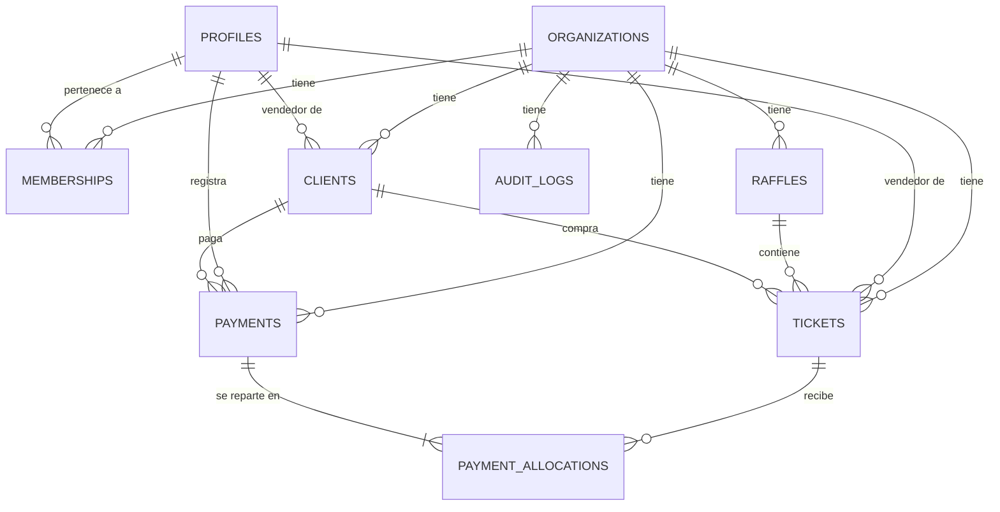

# MODELO DE DATOS

- **Versión:** 2.2 · **Fase:** 5 · **Actualizado:** 2026-08-03
- **Estado:** IMPLEMENTADO y verificado. El esquema vive en `supabase/migrations/0001` a `0012`.
  Las 11 primeras están aplicadas en local **y** en el proyecto Supabase real; la `0012` solo en
  local — ver `KNOWN_ISSUES.md` §4.
- Este documento describe el diseño; la **fuente de verdad ejecutable** son las migraciones y los
  tipos generados en `src/types/database.types.ts`. Las 199 pruebas de `tests/db/` verifican que el
  esquema real cumple lo aquí descrito.

### Ajustes introducidos al implementar (Fase 2)

| Cambio | Motivo | Decisión |
|---|---|---|
| `short_code` e `internal_code` con `DEFAULT ''` + `CHECK <> ''` | Los genera un trigger; sin DEFAULT los tipos los exigían al insertar | D-039 |
| Agregaciones monetarias de las vistas casteadas a `bigint` | `sum(bigint)` devuelve `numeric` y rompía la consistencia de tipos | D-040 |
| Trigger `tickets_guard_paid_amount` | Impide escribir un `paid_amount` inventado, aunque se tenga permiso sobre la fila | — |
| Migraciones `0009`/`0010` de privilegios | Los `GRANT` por defecto de Supabase no son iguales en todos los entornos | D-037, D-038 |
| Auditoría con lista de exclusión | Evita miles de entradas por contadores internos y columnas derivadas | D-041 |

### Ajustes introducidos al implementar (Fase 3)

| Cambio | Motivo | Decisión |
|---|---|---|
| `0011`: `profiles_select` deja de exigir que la membresía **objetivo** esté activa | Al desactivar a un usuario desaparecía del listado y no se podía reactivar | I-011 |

### Ajustes introducidos al implementar (Fase 5)

| Cambio | Motivo | Decisión |
|---|---|---|
| `0012`: `v_payment_history` pasa a **LEFT JOIN** sobre `profiles` y añade `voided_by_name` | Con INNER JOIN, un nombre invisible para quien consulta borraba el pago entero de su historial | I-015 |

**Regla que se desprende:** en una vista `security_invoker`, todo `JOIN` contra una tabla con RLS
debe ser `LEFT JOIN` salvo que se pueda demostrar que quien ve la fila principal ve también la
unida. Un INNER JOIN ahí no filtra columnas: elimina filas.

### Ajustes introducidos al implementar (Fase 6)

| Cambio | Motivo | Decisión |
|---|---|---|
| `0013`: funciones `report_payment_totals` y `report_payments_by_day` | El reporte de pagos necesita agregados **parametrizados** por rango, vendedor, método y estado. Una vista no acepta parámetros, y agrupar por todas esas columnas para poder filtrarlas después supera el límite de 1.000 filas de PostgREST | D-057 |

**Regla que se desprende:** un agregado con parámetros es una **función `stable security invoker`**,
no una vista. `SECURITY INVOKER` —al contrario que las RPC de escritura de `0007`, que son
`SECURITY DEFINER`— porque solo lee: así hereda la RLS de quien consulta y el aislamiento entre
vendedores se mantiene sin que la función filtre nada.

---

## 1. Diagrama entidad-relación



`auth.users` (gestionada por Supabase Auth) se relaciona 1:1 con `profiles` mediante el mismo `id`.

---

## 2. Estrategia multiorganización

| Decisión | Detalle |
|----------|---------|
| Frontera | `organizations.id`. Ningún dato cruza esa frontera. |
| Propagación | **Todas** las tablas de negocio llevan `organization_id` propio y `NOT NULL`. |
| Consistencia | Claves foráneas **compuestas** que incluyen `organization_id` (ver §4.3). Es imposible que una boleta apunte a una rifa de otra organización. |
| Pertenencia de usuario | Tabla `memberships` (usuario × organización × rol). Un usuario puede, en el futuro, pertenecer a varias organizaciones. |
| Organización activa | En el MVP se deriva de la única membresía activa del usuario. Si en el futuro hay varias, se elegirá explícitamente y se guardará en cookie firmada; las políticas RLS no cambian. |

---

## 3. Convenciones

### 3.1 Generales
- Claves primarias `uuid` con `DEFAULT gen_random_uuid()`.
- `created_at timestamptz NOT NULL DEFAULT now()`; `updated_at timestamptz NOT NULL DEFAULT now()`
  mantenida por el trigger genérico `set_updated_at()`.
- Nombres de tabla en plural, en inglés, `snake_case`. Valores de enumeración en inglés; las
  etiquetas en español viven en la aplicación (`lib/constants.ts`).
- Borrado físico prohibido en entidades con historial: se usa `archived_at`, `cancelled_at` o
  `voided_at`.

### 3.2 Tipos por naturaleza del dato

| Naturaleza | Tipo | Razón |
|------------|------|-------|
| Dinero | `bigint` (pesos enteros) | Sin errores de punto flotante; `bigint` evita desbordes en acumulados |
| Números de boleta | `text` | Conserva ceros iniciales; nunca se castea a numérico |
| Fecha de negocio (`sale_date`, `payment_date`) | `date` | Es un día calendario en `America/Bogota`, no un instante |
| Marca de tiempo técnica | `timestamptz` | Instante absoluto, almacenado en UTC |
| Estado | `enum` de PostgreSQL | Valores cerrados, validados por el motor |
| Datos flexibles de auditoría | `jsonb` | Estructura variable por entidad |

> **Prohibido:** `float`, `real`, `double precision`, `money` y `numeric` para valores monetarios.

### 3.3 Tipos enumerados

```sql
CREATE TYPE app_role            AS ENUM ('owner', 'admin', 'seller');
CREATE TYPE raffle_status       AS ENUM ('draft', 'active', 'closed', 'cancelled');
CREATE TYPE ticket_inventory_status AS ENUM ('draft', 'pending_approval', 'available', 'assigned', 'cancelled');
CREATE TYPE ticket_payment_status   AS ENUM ('unpaid', 'partial', 'paid');
CREATE TYPE payment_method      AS ENUM ('cash', 'transfer', 'other');
```

---

## 4. Tablas

### 4.1 `organizations`

| Columna | Tipo | Restricciones |
|---------|------|---------------|
| `id` | `uuid` | PK, `DEFAULT gen_random_uuid()` |
| `name` | `text` | `NOT NULL`, `CHECK (length(btrim(name)) BETWEEN 2 AND 120)` |
| `default_ticket_price` | `bigint` | `NOT NULL DEFAULT 100000`, `CHECK (> 0)` |
| `currency` | `char(3)` | `NOT NULL DEFAULT 'COP'`, `CHECK (currency = 'COP')` (MVP) |
| `timezone` | `text` | `NOT NULL DEFAULT 'America/Bogota'` |
| `raffle_counter` | `int` | `NOT NULL DEFAULT 0` — genera `raffles.short_code` |
| `is_active` | `boolean` | `NOT NULL DEFAULT true` |
| `created_at` / `updated_at` | `timestamptz` | `NOT NULL DEFAULT now()` |

### 4.2 `profiles` (1:1 con `auth.users`)

| Columna | Tipo | Restricciones |
|---------|------|---------------|
| `id` | `uuid` | PK, FK → `auth.users(id)` `ON DELETE CASCADE` |
| `full_name` | `text` | `NOT NULL`, `CHECK (length(btrim(full_name)) >= 2)` |
| `alias` | `text` | `NULL` |
| `phone` | `text` | `NOT NULL`, `CHECK (phone ~ '^[0-9+ ()-]{7,20}$')` |
| `email` | `text` | `NOT NULL` — copia desnormalizada de `auth.users.email` para búsqueda |
| `is_active` | `boolean` | `NOT NULL DEFAULT true` — desactivación global de la persona |
| `created_at` / `updated_at` | `timestamptz` | `NOT NULL DEFAULT now()` |

- Se crea automáticamente con un trigger `AFTER INSERT ON auth.users`.
- `email` se sincroniza con un trigger sobre `auth.users`; la fuente de verdad sigue siendo Auth.

### 4.3 `memberships` (usuario × organización × rol)

| Columna | Tipo | Restricciones |
|---------|------|---------------|
| `id` | `uuid` | PK |
| `organization_id` | `uuid` | `NOT NULL`, FK → `organizations(id)` `ON DELETE RESTRICT` |
| `profile_id` | `uuid` | `NOT NULL`, FK → `profiles(id)` `ON DELETE RESTRICT` |
| `role` | `app_role` | `NOT NULL` |
| `is_active` | `boolean` | `NOT NULL DEFAULT true` |
| `invited_by` | `uuid` | FK → `profiles(id)`, `NULL` |
| `created_at` / `updated_at` | `timestamptz` | `NOT NULL DEFAULT now()` |

Restricciones clave:

```sql
-- Un usuario tiene un único rol por organización
ALTER TABLE memberships ADD CONSTRAINT memberships_org_profile_key
  UNIQUE (organization_id, profile_id);

-- Habilita las FK compuestas de las tablas hijas (garantía de organización)
ALTER TABLE memberships ADD CONSTRAINT memberships_profile_org_key
  UNIQUE (profile_id, organization_id);

-- Exactamente un Owner activo por organización
CREATE UNIQUE INDEX memberships_one_owner_per_org
  ON memberships (organization_id)
  WHERE role = 'owner' AND is_active;
```

**Acceso efectivo** = `profiles.is_active` **AND** `memberships.is_active` **AND**
`organizations.is_active`. Cualquiera de los tres en `false` bloquea el ingreso y la operación.

#### Patrón de clave foránea compuesta (garantía de organización)

Cada tabla hija expone `UNIQUE (id, organization_id)` para que sus hijas puedan referenciarla
incluyendo la organización. Ejemplo con boletas:

```sql
ALTER TABLE raffles ADD CONSTRAINT raffles_id_org_key UNIQUE (id, organization_id);

ALTER TABLE tickets ADD CONSTRAINT tickets_raffle_same_org_fk
  FOREIGN KEY (raffle_id, organization_id)
  REFERENCES raffles (id, organization_id) ON DELETE RESTRICT;
```

Resultado: **es estructuralmente imposible** que una boleta pertenezca a una rifa de otra
organización, incluso con `SERVICE_ROLE` o con un error de programación.

### 4.4 `raffles`

| Columna | Tipo | Restricciones |
|---------|------|---------------|
| `id` | `uuid` | PK |
| `organization_id` | `uuid` | `NOT NULL`, FK → `organizations(id)` |
| `short_code` | `text` | `NOT NULL`, `UNIQUE (organization_id, short_code)` — generado `R001`, `R002`… |
| `name` | `text` | `NOT NULL`, `UNIQUE (organization_id, lower(btrim(name)))` |
| `description` | `text` | `NULL` |
| `ticket_price` | `bigint` | `NOT NULL DEFAULT 100000`, `CHECK (ticket_price > 0)` |
| `currency` | `char(3)` | `NOT NULL DEFAULT 'COP'` |
| `start_date` | `date` | `NOT NULL` |
| `end_date` | `date` | `NOT NULL`, `CHECK (end_date >= start_date)` |
| `status` | `raffle_status` | `NOT NULL DEFAULT 'draft'` |
| `allow_seller_ticket_creation` | `boolean` | `NOT NULL DEFAULT false` |
| `ticket_counter` | `bigint` | `NOT NULL DEFAULT 0` — genera `tickets.internal_code` |
| `created_by` | `uuid` | `NOT NULL`, FK → `profiles(id)` |
| `created_at` / `updated_at` | `timestamptz` | `NOT NULL DEFAULT now()` |
| `closed_at` | `timestamptz` | `NULL` |

- El precio predeterminado `100000` proviene de `organizations.default_ticket_price` al crear.
- Cambiar `ticket_price` **no** afecta boletas ya vendidas (§4.6, `sale_price`).
- Transiciones de estado válidas: `draft → active → closed`; cualquier estado → `cancelled`.
  `closed → active` se permite solo a Owner (reapertura documentada en auditoría).

### 4.5 `clients`

| Columna | Tipo | Restricciones |
|---------|------|---------------|
| `id` | `uuid` | PK |
| `organization_id` | `uuid` | `NOT NULL`, FK → `organizations(id)` |
| `seller_id` | `uuid` | `NOT NULL`, FK compuesta → `memberships(profile_id, organization_id)` |
| `name` | `text` | `NOT NULL`, `CHECK (length(btrim(name)) >= 2)` |
| `alias` | `text` | `NULL` |
| `phone` | `text` | `NOT NULL`, `CHECK (phone ~ '^[0-9+ ()-]{7,20}$')` |
| `email` | `text` | `NULL`, `CHECK (email IS NULL OR email ~* '^[^@\s]+@[^@\s]+\.[^@\s]+$')` |
| `notes` | `text` | `NULL` |
| `created_at` / `updated_at` | `timestamptz` | `NOT NULL DEFAULT now()` |
| `archived_at` | `timestamptz` | `NULL` — archivado en lugar de borrado |

Adicional: `UNIQUE (id, organization_id)`, `UNIQUE (id, seller_id)` (habilitan FK compuestas).

- Un cliente pertenece a **un** vendedor; no se comparte automáticamente entre vendedores.
- El mismo teléfono puede repetirse entre vendedores (son carteras separadas); se avisa en UI
  como advertencia, no como error.
- Búsqueda por nombre, alias, teléfono y email mediante índice `pg_trgm` (§5).

### 4.6 `tickets`

| Columna | Tipo | Restricciones |
|---------|------|---------------|
| `id` | `uuid` | PK |
| `organization_id` | `uuid` | `NOT NULL`, FK → `organizations(id)` |
| `raffle_id` | `uuid` | `NOT NULL`, FK compuesta → `raffles(id, organization_id)` |
| `seller_id` | `uuid` | `NOT NULL`, FK compuesta → `memberships(profile_id, organization_id)` |
| `client_id` | `uuid` | `NULL`, FK compuesta → `clients(id, organization_id)` `ON DELETE RESTRICT` |
| `internal_code` | `text` | `NOT NULL`, `UNIQUE (organization_id, internal_code)` — `R001-000123` |
| `daily_number` | `text` | `NULL` solo en `draft`; `CHECK (daily_number ~ '^[0-9]{1,4}$')` |
| `weekly_number` | `text` | `NULL` solo en `draft`; `CHECK (weekly_number ~ '^[0-9]{1,4}$')` |
| `sale_price` | `bigint` | `NULL` hasta la venta; `CHECK (sale_price > 0)` |
| `inventory_status` | `ticket_inventory_status` | `NOT NULL DEFAULT 'draft'` |
| `paid_amount` | `bigint` | `NOT NULL DEFAULT 0`, materializada por trigger |
| `payment_status` | `ticket_payment_status` | Columna **generada** (§4.6.4) |
| `assigned_at` | `timestamptz` | `NULL` |
| `sale_date` | `date` | `NULL` |
| `created_by` | `uuid` | `NOT NULL`, FK → `profiles(id)` |
| `approved_by` | `uuid` | `NULL`, FK → `profiles(id)` |
| `approved_at` | `timestamptz` | `NULL` |
| `cancelled_at` | `timestamptz` | `NULL` |
| `cancel_reason` | `text` | `NULL` |
| `created_at` / `updated_at` | `timestamptz` | `NOT NULL DEFAULT now()` |

#### 4.6.1 Numeración (regla crítica)

```sql
-- Solo dígitos ASCII, de 1 a 4. Se usa [0-9] y no \d: en PostgreSQL \d puede
-- coincidir con dígitos Unicode de otros alfabetos.
CONSTRAINT tickets_daily_number_format  CHECK (daily_number  ~ '^[0-9]{1,4}$'),
CONSTRAINT tickets_weekly_number_format CHECK (weekly_number ~ '^[0-9]{1,4}$'),
```

- Los valores se guardan **exactamente** como se escriben: `'007'` ≠ `'7'`. Nunca se aplica
  `TRIM`, `LTRIM`, `::int` ni normalización de ceros en ninguna capa.
- Válidos: `1`, `25`, `007`, `0000`, `9999`. Inválidos: `12345`, `12A4`, `-123`, `12.5`, `''`.
- Una boleta en `draft` puede tener números `NULL` (aún no capturados). Fuera de `draft` son
  obligatorios (§4.6.3).

#### 4.6.2 Snapshot de precio

- `sale_price` se copia desde `raffles.ticket_price` **en el momento de asignar** la boleta.
- Trigger `tickets_protect_sale_price`: si `paid_amount > 0`, cualquier `UPDATE` de `sale_price`
  se rechaza. Solo un procedimiento administrativo documentado (anular pagos → corregir → volver a
  registrar) puede cambiarlo.
- Modificar `raffles.ticket_price` no propaga cambios a boletas existentes.

#### 4.6.3 Restricciones de integridad y unicidad

```sql
-- Unicidad de la combinación dentro de la rifa. Sin seller_id: aplica ENTRE vendedores.
-- Sin filtro WHERE: incluye boletas anuladas, por lo que una combinación anulada
-- NO puede reutilizarse dentro de la misma rifa (regla del MVP).
ALTER TABLE tickets ADD CONSTRAINT tickets_combo_unique
  UNIQUE (organization_id, raffle_id, daily_number, weekly_number);

-- Coherencia de estado ↔ datos
CONSTRAINT tickets_numbers_required_unless_draft CHECK (
  inventory_status = 'draft'
  OR (daily_number IS NOT NULL AND weekly_number IS NOT NULL)
),
CONSTRAINT tickets_assigned_requires_sale CHECK (
  inventory_status <> 'assigned'
  OR (client_id IS NOT NULL AND sale_price IS NOT NULL
      AND sale_date IS NOT NULL AND assigned_at IS NOT NULL)
),
CONSTRAINT tickets_client_requires_assigned CHECK (
  client_id IS NULL OR inventory_status IN ('assigned', 'cancelled')
),
CONSTRAINT tickets_available_has_no_client CHECK (
  inventory_status <> 'available' OR client_id IS NULL
),
CONSTRAINT tickets_approved_fields CHECK (
  (approved_by IS NULL) = (approved_at IS NULL)
),
CONSTRAINT tickets_cancelled_fields CHECK (
  inventory_status <> 'cancelled' OR cancelled_at IS NOT NULL
),
CONSTRAINT tickets_paid_amount_range CHECK (
  paid_amount >= 0 AND (sale_price IS NULL OR paid_amount <= sale_price)
),

-- Habilita la FK compuesta que impide pagar la boleta de otro cliente
ALTER TABLE tickets ADD CONSTRAINT tickets_id_client_key UNIQUE (id, client_id);
```

> **Nota sobre `NULL` y unicidad:** PostgreSQL considera distintos los `NULL` en índices únicos, por
> lo que varias boletas `draft` sin números coexisten sin conflicto. En cuanto una fila deja de ser
> `draft`, los números son obligatorios y la unicidad aplica plenamente.

#### 4.6.4 Estado de pago calculado

`inventory_status` y `payment_status` son **dimensiones independientes**. El vendedor nunca
selecciona el estado de pago.

```sql
payment_status ticket_payment_status GENERATED ALWAYS AS (
  CASE
    WHEN sale_price IS NULL OR paid_amount = 0 THEN 'unpaid'::ticket_payment_status
    WHEN paid_amount < sale_price             THEN 'partial'::ticket_payment_status
    ELSE                                            'paid'::ticket_payment_status
  END
) STORED
```

- `pending_amount` = `sale_price - paid_amount` (expuesto por la vista `v_ticket_balances`).
- `paid_amount` lo mantiene el trigger `recalc_ticket_paid_amount()` a partir de asignaciones de
  pagos **no anulados**. La `CHECK` de rango convierte el sobrepago en un error de base de datos,
  no solo de aplicación.

Matriz de combinaciones válidas:

| `inventory_status` | `payment_status` posible | Comentario |
|---|---|---|
| `draft` | `unpaid` | Sin cliente, sin precio |
| `pending_approval` | `unpaid` | Esperando aprobación |
| `available` | `unpaid` | Aprobada, sin cliente |
| `assigned` | `unpaid`, `partial`, `paid` | Único estado que admite pagos |
| `cancelled` | `unpaid` | Solo se anula si no tiene pagos activos |

#### 4.6.5 Generación de `internal_code`

Trigger `BEFORE INSERT` cuando `internal_code IS NULL`: incrementa `raffles.ticket_counter` con
bloqueo de fila y produce `{raffles.short_code}-{lpad(counter,6,'0')}`.
Para la creación masiva, la RPC reserva el bloque completo de una vez
(`UPDATE raffles SET ticket_counter = ticket_counter + n RETURNING …`) y asigna los códigos de forma
conjunta, evitando 1.000 actualizaciones secuenciales.

### 4.7 `payments`

| Columna | Tipo | Restricciones |
|---------|------|---------------|
| `id` | `uuid` | PK |
| `organization_id` | `uuid` | `NOT NULL`, FK → `organizations(id)` |
| `seller_id` | `uuid` | `NOT NULL`, FK compuesta → `memberships(profile_id, organization_id)` |
| `client_id` | `uuid` | `NOT NULL`, FK compuesta → `clients(id, organization_id)` |
| `total_amount` | `bigint` | `NOT NULL`, `CHECK (total_amount > 0)` |
| `payment_date` | `date` | `NOT NULL DEFAULT today_bogota()` |
| `payment_method` | `payment_method` | `NOT NULL DEFAULT 'cash'` |
| `notes` | `text` | `NULL` |
| `created_by` | `uuid` | `NOT NULL`, FK → `profiles(id)` |
| `created_at` | `timestamptz` | `NOT NULL DEFAULT now()` |
| `voided_at` | `timestamptz` | `NULL` |
| `voided_by` | `uuid` | `NULL`, FK → `profiles(id)` |
| `void_reason` | `text` | `NULL` |

```sql
CONSTRAINT payments_void_fields CHECK (
  (voided_at IS NULL AND voided_by IS NULL AND void_reason IS NULL)
  OR (voided_at IS NOT NULL AND voided_by IS NOT NULL
      AND length(btrim(void_reason)) >= 5)
),
-- Habilita la FK compuesta de asignaciones
ALTER TABLE payments ADD CONSTRAINT payments_id_client_key UNIQUE (id, client_id);
```

Los pagos **no se eliminan nunca**. RLS no concede `DELETE` a ningún rol.

### 4.8 `payment_allocations`

| Columna | Tipo | Restricciones |
|---------|------|---------------|
| `id` | `uuid` | PK |
| `payment_id` | `uuid` | `NOT NULL`, FK → `payments(id)` `ON DELETE RESTRICT` |
| `ticket_id` | `uuid` | `NOT NULL`, FK → `tickets(id)` `ON DELETE RESTRICT` |
| `client_id` | `uuid` | `NOT NULL` — desnormalizada para las FK compuestas |
| `organization_id` | `uuid` | `NOT NULL` — desnormalizada para RLS eficiente |
| `amount` | `bigint` | `NOT NULL`, `CHECK (amount > 0)` |
| `created_at` | `timestamptz` | `NOT NULL DEFAULT now()` |

```sql
-- La asignación pertenece al mismo cliente que el pago…
ALTER TABLE payment_allocations ADD CONSTRAINT alloc_payment_client_fk
  FOREIGN KEY (payment_id, client_id) REFERENCES payments (id, client_id);

-- …y la boleta pagada es del MISMO cliente.
-- Como client_id es NOT NULL aquí, una boleta sin cliente no puede recibir pagos.
ALTER TABLE payment_allocations ADD CONSTRAINT alloc_ticket_client_fk
  FOREIGN KEY (ticket_id, client_id) REFERENCES tickets (id, client_id);

-- Una sola asignación por (pago, boleta): evita duplicados accidentales
ALTER TABLE payment_allocations ADD CONSTRAINT alloc_payment_ticket_key
  UNIQUE (payment_id, ticket_id);
```

**Cuadre pago ↔ asignaciones.** `SUM(payment_allocations.amount) = payments.total_amount` se verifica
con un *constraint trigger* `DEFERRABLE INITIALLY DEFERRED` sobre ambas tablas: se comprueba al
confirmar la transacción, permitiendo insertar el pago y sus asignaciones en cualquier orden dentro
de la misma transacción, pero impidiendo confirmar un estado descuadrado.

### 4.9 `audit_logs`

| Columna | Tipo | Restricciones |
|---------|------|---------------|
| `id` | `bigint` | PK, `GENERATED ALWAYS AS IDENTITY` |
| `organization_id` | `uuid` | `NOT NULL`, FK → `organizations(id)` |
| `actor_profile_id` | `uuid` | `NULL` (procesos del sistema), FK → `profiles(id)` |
| `action` | `text` | `NOT NULL` — p. ej. `payment.void`, `ticket.approve` |
| `entity_type` | `text` | `NOT NULL` — `ticket`, `payment`, `raffle`, `membership`, `client` |
| `entity_id` | `uuid` | `NULL` |
| `old_values` | `jsonb` | `NULL` |
| `new_values` | `jsonb` | `NULL` |
| `ip_address` | `inet` | `NULL` |
| `user_agent` | `text` | `NULL` |
| `created_at` | `timestamptz` | `NOT NULL DEFAULT now()` |

Append-only: sin políticas de `UPDATE` ni `DELETE` para ningún rol. La escritura ocurre desde
triggers y funciones `SECURITY DEFINER`. Eventos mínimos registrados: `docs/SECURITY.md` §6.

---

## 5. Índices

| Tabla | Índice | Motivo |
|-------|--------|--------|
| `memberships` | `(organization_id, role) WHERE is_active` | Listados de vendedores/administradores |
| `memberships` | `(profile_id) WHERE is_active` | Resolución de sesión en cada request |
| `raffles` | `(organization_id, status)` | Rifa activa y listados |
| `clients` | `(organization_id, seller_id) WHERE archived_at IS NULL` | Cartera del vendedor |
| `clients` | GIN `pg_trgm` sobre `name`, `alias`, `phone`, `email` | Búsqueda por texto parcial |
| `tickets` | `(organization_id, raffle_id, inventory_status)` | Tabla global con filtros |
| `tickets` | `(seller_id, raffle_id, inventory_status)` | Portal Seller |
| `tickets` | `(organization_id, raffle_id, daily_number)` | Búsqueda por número diario |
| `tickets` | `(organization_id, raffle_id, weekly_number)` | Búsqueda por número semanal |
| `tickets` | `(organization_id, internal_code)` (único) | Búsqueda por código |
| `tickets` | `(client_id) WHERE client_id IS NOT NULL` | Perfil de cliente |
| `tickets` | `(organization_id, raffle_id, payment_status)` | Métricas y reportes |
| `payments` | `(organization_id, payment_date DESC) WHERE voided_at IS NULL` | Pagos recientes y por rango |
| `payments` | `(seller_id, payment_date DESC)` | Portal Seller |
| `payments` | `(client_id, payment_date DESC)` | Historial del cliente |
| `payment_allocations` | `(ticket_id)` | Recálculo de saldo |
| `payment_allocations` | `(payment_id)` | Detalle del pago |
| `audit_logs` | `(organization_id, created_at DESC)` | Consulta de bitácora |
| `audit_logs` | `(entity_type, entity_id, created_at DESC)` | Historial por entidad |

La unicidad de `tickets_combo_unique` genera su propio índice, que además sirve para detectar
duplicados durante la carga masiva.

---

## 6. Vistas

> **Regla de seguridad obligatoria:** todas las vistas se crean con
> `WITH (security_invoker = true)`. Sin esa opción, una vista se ejecuta con los permisos de su
> propietario y **omitiría las políticas RLS** de las tablas base, filtrando datos entre vendedores.

| Vista | Contenido | Consumidor |
|-------|-----------|------------|
| `v_ticket_balances` | boleta + `sale_price`, `paid_amount`, `pending_amount`, `payment_status` | Listados, perfil de cliente |
| `v_client_balances` | por cliente: total comprado, total pagado, saldo, número de boletas | Perfil de cliente, reportes |
| `v_seller_summary` | por vendedor: boletas por estado, vendido, recaudado, saldo | Dashboard admin, reportes |
| `v_raffle_summary` | por rifa: totales de inventario y dinero | Dashboard admin |
| `v_payment_history` | pagos con cliente, vendedor, método, estado activo/anulado y asignaciones | Historial y anulaciones |

### 6.b Funciones de reporte (Fase 6, migración `0013`)

Cuando el agregado necesita **parámetros**, una vista no sirve. Estas dos son `stable`,
`security invoker` y `set search_path`, y filtran **antes** de agregar (D-057):

| Función | Devuelve | Consumidor |
|---|---|---|
| `report_payment_totals(from, to, seller, method, status)` | **una fila**: nº de pagos, total, y el desglose vigente/anulado | Encabezado del reporte «Pagos por fecha» |
| `report_payments_by_day(from, to, seller, method, status)` | **una fila por día**: nº de pagos, total, recaudado y anulado | Tabla del mismo reporte y su CSV |

`p_seller_id` sirve para que el **personal** acote el reporte a un vendedor. No es un control de
seguridad: la RLS de `payments` ya limita lo que cada quien puede agregar, así que un vendedor que
pase el id de otro obtiene ceros (prueba F6-04).

---

## 7. Triggers

| Trigger | Tabla | Momento | Función |
|---------|-------|---------|---------|
| `set_updated_at` | todas con `updated_at` | `BEFORE UPDATE` | Actualiza la marca de tiempo |
| `handle_new_auth_user` | `auth.users` | `AFTER INSERT` | Crea el `profile` correspondiente |
| `sync_profile_email` | `auth.users` | `AFTER UPDATE OF email` | Sincroniza `profiles.email` |
| `tickets_set_internal_code` | `tickets` | `BEFORE INSERT` | Genera `internal_code` |
| `tickets_enforce_seller_role` | `tickets` | `BEFORE INSERT/UPDATE` | `seller_id` debe tener membresía activa con rol `seller` |
| `tickets_protect_sale_price` | `tickets` | `BEFORE UPDATE` | Bloquea cambio de `sale_price` con `paid_amount > 0` |
| `tickets_protect_client_change` | `tickets` | `BEFORE UPDATE` | Bloquea cambio de `client_id` con pagos activos |
| `tickets_validate_status_transition` | `tickets` | `BEFORE UPDATE` | Aplica la máquina de estados (BR-I01) |
| `recalc_ticket_paid_amount` | `payment_allocations` | `AFTER INSERT/UPDATE/DELETE` | Recalcula `tickets.paid_amount` |
| `recalc_on_payment_void` | `payments` | `AFTER UPDATE OF voided_at` | Recalcula las boletas afectadas |
| `payments_balance_check` | `payments`, `payment_allocations` | `CONSTRAINT … DEFERRABLE` | Cuadre suma = total |
| `audit_*` | tablas críticas | `AFTER INSERT/UPDATE` | Escribe en `audit_logs` |

**Prevención de recursión:** los triggers de auditoría escriben en `audit_logs` mediante una función
`SECURITY DEFINER` que no dispara triggers adicionales, y `audit_logs` no tiene triggers propios.
Las funciones de trigger declaran `SET search_path = public, pg_temp`.

---

## 8. Cardinalidades y pertenencia

| Relación | Cardinalidad | Borrado | Pertenencia (ownership) |
|----------|--------------|---------|-------------------------|
| organización → membresías | 1:N | `RESTRICT` | Organización |
| perfil → membresías | 1:N | `RESTRICT` | Persona |
| organización → rifas | 1:N | `RESTRICT` | Organización |
| rifa → boletas | 1:N | `RESTRICT` | Organización + rifa |
| vendedor → boletas | 1:N | `RESTRICT` | Organización + vendedor |
| vendedor → clientes | 1:N | `RESTRICT` (se archiva) | Organización + vendedor |
| cliente → boletas | 1:N | `RESTRICT` | Cliente (dentro del vendedor) |
| cliente → pagos | 1:N | `RESTRICT` | Organización + vendedor + cliente |
| pago → asignaciones | 1:N (≥1) | `RESTRICT` | Pago |
| boleta → asignaciones | 1:N | `RESTRICT` | Boleta |

Reglas de pertenencia derivadas:
- Una boleta tiene **un solo cliente activo**; un cliente puede tener **varias boletas**.
- Un cliente pertenece a un vendedor; **no** se comparte automáticamente entre vendedores.
- Un pago pertenece a un cliente y, por tanto, a un vendedor.
- Ninguna entidad con historial se borra físicamente.

---

## 9. Casos extremos cubiertos por el modelo

| # | Caso | Comportamiento del modelo |
|---|------|---------------------------|
| E1 | Dos boletas con la misma combinación en la misma rifa | Rechazo por `tickets_combo_unique` |
| E2 | Misma combinación en distinta rifa | Permitido |
| E3 | Combinación de una boleta anulada, reutilizada | Rechazo (el índice único incluye anuladas) |
| E4 | `0000` como número | Válido (1–4 dígitos) |
| E5 | `007` vs `7` | Combinaciones distintas; ambas pueden coexistir |
| E6 | Boleta `draft` sin números | Permitido; obligatorio al salir de `draft` |
| E7 | Pago a boleta sin cliente | Imposible: FK compuesta exige `client_id` no nulo |
| E8 | Pago a boleta de otro cliente | Imposible: FK `alloc_ticket_client_fk` |
| E9 | Sobrepago | Rechazo por `tickets_paid_amount_range` + validación en RPC con bloqueo |
| E10 | Dos abonos simultáneos que juntos exceden el saldo | El segundo falla: bloqueo de fila + `CHECK` |
| E11 | Pago que no cuadra con sus asignaciones | Rechazo al confirmar (constraint trigger diferido) |
| E12 | Anular un pago | `paid_amount` se recalcula; `payment_status` vuelve a `unpaid`/`partial` |
| E13 | Cambiar el precio de la rifa después de vender | Boletas vendidas conservan `sale_price` |
| E14 | Cambiar el cliente de una boleta con pagos | Bloqueado por trigger |
| E15 | Anular una boleta con pagos activos | Bloqueado; primero deben anularse los pagos |
| E16 | Boleta de una rifa de otra organización | Imposible por FK compuesta |
| E17 | Vendedor desactivado con boletas activas | Los datos permanecen; el acceso se bloquea por RLS |
| E18 | Dos Owners activos en una organización | Rechazo por índice único parcial |
| E19 | Cliente con historial que se intenta borrar | `RESTRICT`; la UI ofrece archivar |
| E20 | Acumulado monetario grande (1.000 boletas × $100.000) | `bigint` soporta el rango sin desborde |
